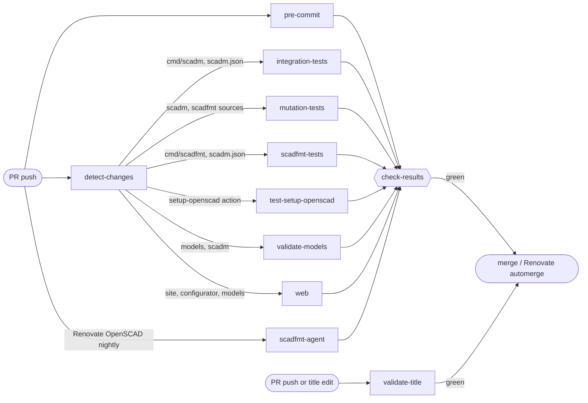
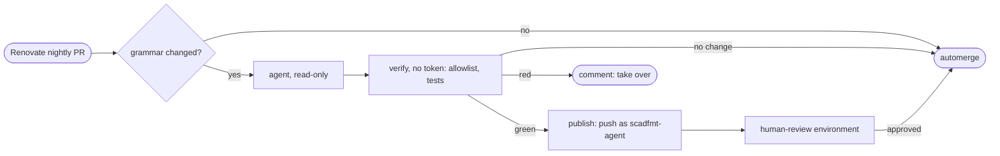

# ⚙️ CI Overview

## 🚦 PR Gate

Every PR runs one pipeline, [`ci.yml`](ci.yml). Branch protection on `main` requires `check-results`, which fails when any job failed or was cancelled, and `validate-title`. A path-filtered job that did not run counts as passed, so it is required exactly when it applies. See [gate-prs-with-a-single-check-results-job](../../docs/decisions/gate-prs-with-a-single-check-results-job.md).

Each box inside the gate is a workflow file called through `workflow_call`. Its path filter lives in `detect-changes`, not in the file. `validate-title` stays outside: it must rerun on title edits, and rerunning the whole gate on every PR edit (Renovate rewrites PR bodies constantly) is too costly.

### ➕ Adding a PR Job

1. Give the workflow an `on: workflow_call` trigger, no `pull_request` paths of its own.
2. Add a filter to `detect-changes` in `ci.yml` if it only runs for some paths.
3. Call it from `ci.yml` with the permissions it needs.
4. Add it to the `needs` of `check-results`. A job missing there is not required.

## 📋 Workflows

| Workflow | Triggers | Does |
|---|---|---|
| [`ci.yml`](ci.yml) | PR | Runs the PR gate above |
| [`pre-commit.yml`](pre-commit.yml) | `ci.yml`, push to `main` | All pre-commit hooks: linters, unit tests, flatten validation |
| [`validate-pr-title.yml`](validate-pr-title.yml) | PR, incl. title edits | Conventional Commits title, since PRs are squash-merged. Required directly |
| [`integration-tests.yml`](integration-tests.yml) | `ci.yml` | `scadm` CLI integration tests on ubuntu and windows. See [TESTING.md](../../TESTING.md#integration-tests) |
| [`mutation-tests.yml`](mutation-tests.yml) | `ci.yml`, Monday 03:00 UTC, manual | `mutmut` on changed `scadm` and `scadfmt` functions per PR, one PR comment with a section per package; weekly full run per package to Discord and its badge. See [TESTING.md](../../TESTING.md#mutation-testing) |
| [`scadfmt-tests.yml`](scadfmt-tests.yml) | `ci.yml` | `scadfmt` integration tests against the pinned OpenSCAD (canary, and same AST for formatting-only `.scad` changes) and unit tests on windows; Linux unit tests run in pre-commit. See [TESTING.md](../../TESTING.md#scadfmt-tests) |
| [`scadfmt-agent.yml`](scadfmt-agent.yml) | `ci.yml`, Renovate OpenSCAD nightly PR only | When OpenSCAD's grammar changed, a Claude agent adapts scadfmt; the workflow tests and pushes its patch, then `human-review` waits for approval. See [below](#-scadfmt-agent-setup) |
| [`test-setup-openscad.yml`](test-setup-openscad.yml) | `ci.yml` | Input matrix of the `setup-openscad` composite action |
| [`validate-models.yml`](validate-models.yml) | `ci.yml` | Renders every model with OpenSCAD |
| [`web.yml`](web.yml) | `ci.yml`, push to `main`, `e2e-probe-failure` label | Configurator and site lint, tests, build and Playwright E2E |
| [`preview.yml`](preview.yml) | PR, `deploy-preview` label | Publishes a site preview at `/preview/pr-<number>/`. Not part of the gate |
| [`pages.yml`](pages.yml) | Push to `main`, manual | Deploys homeracker.org with all live previews |
| [`release-please.yml`](release-please.yml) | Push to `main` | Opens and updates release PRs from Conventional Commits |
| [`automerge-release.yml`](automerge-release.yml) | Monday 06:00 UTC, manual | Merges the open release PR, which cuts the release |
| [`publish-scadm.yml`](publish-scadm.yml) | `scadm-v*` release, manual | Publishes `scadm` to PyPI |
| [`publish-scadfmt.yml`](publish-scadfmt.yml) | `scadfmt-v*` release, manual | Publishes `scadfmt` to PyPI |
| [`coverage-badge.yml`](coverage-badge.yml) | Push to `main` touching `cmd/scadm` or `cmd/scadfmt`, manual | Publishes the `scadm` and `scadfmt` coverage badges |

## 🔑 GitHub App Setup

The release and automerge workflows need a GitHub App, because pushes and PRs made with the default `GITHUB_TOKEN` do not start further workflows. The app needs:

- Contents: Read & Write
- Pull Requests: Read & Write

Both workflows request exactly these two via `permission-*` inputs. A permission added to the app later also needs its matching input in both workflows.

Repository secrets:

1. `RELEASES_APP_ID`: the GitHub App ID
2. `RELEASES_APP_PRIVATE_KEY`: the GitHub App private key

## 🤖 scadfmt Agent Setup

[`scadfmt-agent.yml`](scadfmt-agent.yml) keeps scadfmt in step with the OpenSCAD nightly. See [agent-adapts-scadfmt-to-openscad-nightly](../../docs/decisions/agent-adapts-scadfmt-to-openscad-nightly.md).

It needs, once:

1. Repository secret `CLAUDE_CODE_OAUTH_TOKEN` from `claude setup-token` (Claude Pro or Max). Renew it when it expires.
2. Environment `scadfmt-review` (Settings → Environments) with you as required reviewer. Without it, `human-review` passes on its own.
3. A GitHub App of its own for the agent, separate from the releases app, so each credential can be rotated or revoked alone. Only an app push starts CI on the agent's commit. Install it on this repo only, with one permission: Contents: Read & Write, and no webhook. Store it as the organisation secrets `KELLERLAB_AGENT_APP_ID` (the app's client ID) and `KELLERLAB_AGENT_SECRET_KEY` (its private key), shared with this repo.

## 📚 References

- [Camunda Infrastructure Actions](https://github.com/camunda/infra-global-github-actions/tree/main/teams/infra/pull-request)
- [Conventional Commits](https://www.conventionalcommits.org/)
- [Release Please](https://github.com/googleapis/release-please)
- [claude-code-action](https://github.com/anthropics/claude-code-action)
