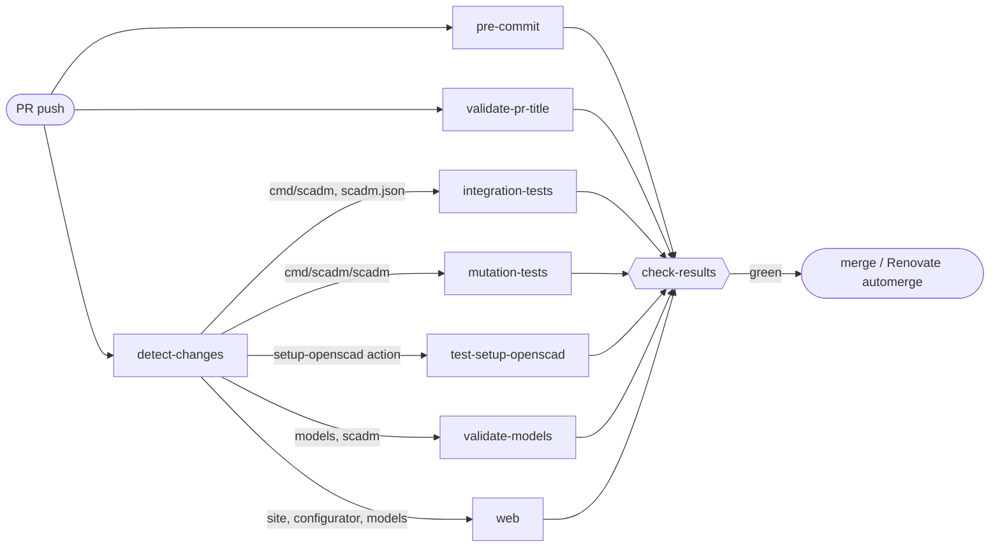

# ⚙️ CI Overview

## 🚦 PR Gate

Every PR runs one pipeline, [`ci.yml`](ci.yml). Branch protection on `main` requires a single check, `check-results`, which fails when any job failed or was cancelled. A path-filtered job that did not run counts as passed, so it is required exactly when it applies. See [gate-prs-with-a-single-check-results-job](../../docs/decisions/gate-prs-with-a-single-check-results-job.md).

Each box is a workflow file called through `workflow_call`. Its path filter lives in `detect-changes`, not in the file.

### ➕ Adding a PR Job

1. Give the workflow an `on: workflow_call` trigger, no `pull_request` paths of its own.
2. Add a filter to `detect-changes` in `ci.yml` if it only runs for some paths.
3. Call it from `ci.yml` with the permissions it needs.
4. Add it to the `needs` of `check-results`. A job missing there is not required.

## 📋 Workflows

| Workflow | Triggers | Does |
|---|---|---|
| [`ci.yml`](ci.yml) | PR | Runs the PR gate above |
| [`pre-commit.yml`](pre-commit.yml) | `ci.yml`, push to `main` | All pre-commit hooks: linters, unit tests, flatten validation |
| [`validate-pr-title.yml`](validate-pr-title.yml) | `ci.yml`, PR title edit | Conventional Commits title, since PRs are squash-merged |
| [`integration-tests.yml`](integration-tests.yml) | `ci.yml` | `scadm` CLI integration tests on ubuntu and windows. See [TESTING.md](../../TESTING.md#integration-tests) |
| [`mutation-tests.yml`](mutation-tests.yml) | `ci.yml`, Monday 03:00 UTC, manual | `mutmut` on changed `scadm` functions per PR with a PR comment; weekly full run to Discord and the badge. See [TESTING.md](../../TESTING.md#mutation-testing) |
| [`test-setup-openscad.yml`](test-setup-openscad.yml) | `ci.yml` | Input matrix of the `setup-openscad` composite action |
| [`validate-models.yml`](validate-models.yml) | `ci.yml` | Renders every model with OpenSCAD |
| [`web.yml`](web.yml) | `ci.yml`, push to `main`, `e2e-probe-failure` label | Configurator and site lint, tests, build and Playwright E2E |
| [`preview.yml`](preview.yml) | PR, `deploy-preview` label | Publishes a site preview at `/preview/pr-<number>/`. Not part of the gate |
| [`pages.yml`](pages.yml) | Push to `main`, manual | Deploys homeracker.org with all live previews |
| [`release-please.yml`](release-please.yml) | Push to `main` | Opens and updates release PRs from Conventional Commits |
| [`automerge-release.yml`](automerge-release.yml) | Monday 06:00 UTC, manual | Merges the open release PR, which cuts the release |
| [`publish-scadm.yml`](publish-scadm.yml) | `scadm-v*` release, manual | Publishes `scadm` to PyPI |
| [`coverage-badge.yml`](coverage-badge.yml) | Push to `main` touching `cmd/scadm`, manual | Publishes the `scadm` coverage badge |

## 🔑 GitHub App Setup

The release and automerge workflows need a GitHub App, because pushes and PRs made with the default `GITHUB_TOKEN` do not start further workflows. The app needs:

- Contents: Read & Write
- Pull Requests: Read & Write

Both workflows request exactly these two via `permission-*` inputs. A permission added to the app later also needs its matching input in both workflows.

Repository secrets:

1. `RELEASES_APP_ID`: the GitHub App ID
2. `RELEASES_APP_PRIVATE_KEY`: the GitHub App private key

## 📚 References

- [Camunda Infrastructure Actions](https://github.com/camunda/infra-global-github-actions/tree/main/teams/infra/pull-request)
- [Conventional Commits](https://www.conventionalcommits.org/)
- [Release Please](https://github.com/googleapis/release-please)
