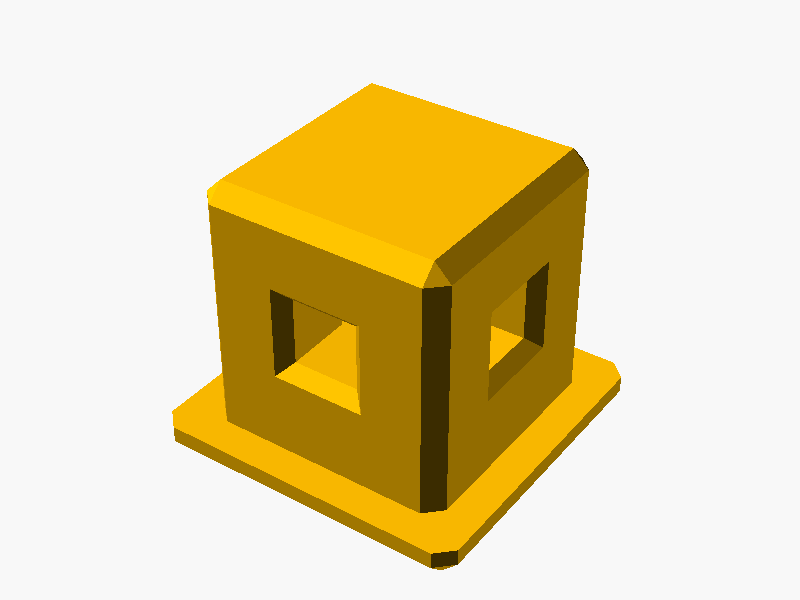
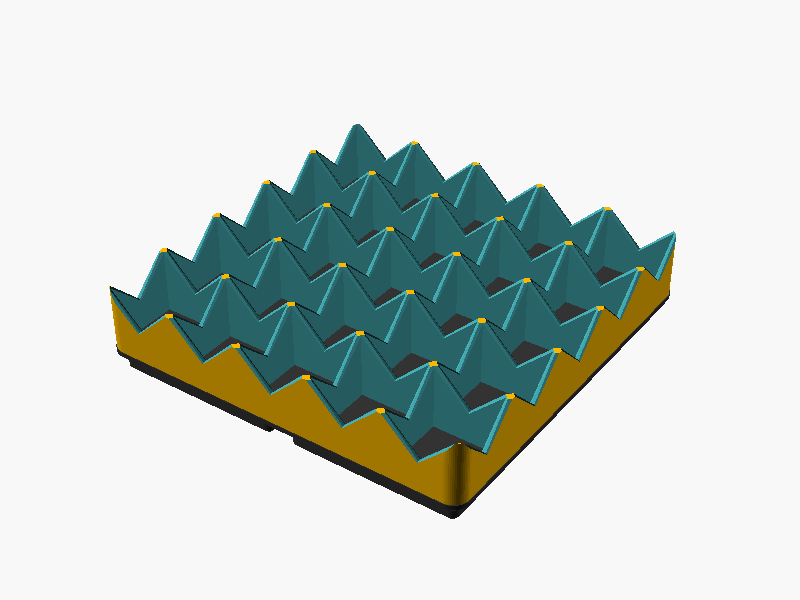
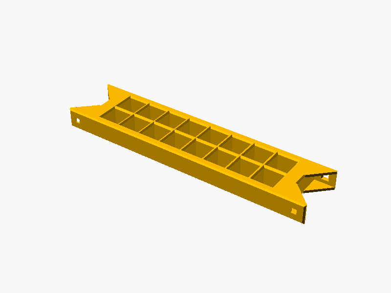

# 📦 Models

This folder contains all `scad` 3D models which come with the HomeRacker project.

## 📑 Contents

### 🧱 Core

The fundamental HomeRacker building system with modular components:

- **Supports**: Vertical and horizontal structural elements
- **Connectors**: Join supports in a variety of dimensions
- **Lock Pins**: Secure connections without tools


See [core/README.md](core/README.md) for details.

### 📐 Gridfinity

Gridfinity-compatible components for modular storage integration:

- **Baseplates**: Mounting surfaces for Gridfinity bins (42mm grid)
- **Bin Bases**: Foundation for custom Gridfinity-compatible containers


See [gridfinity/README.md](gridfinity/README.md) for details.

### 🔩 Rackmount Ears

Fully customizable rackmount ears for standard 10" and 19" rack mounting.


See [rackmount_ears/README.md](rackmount_ears/README.md) for details.

### 🧲 Wall Mount

Wall-mountable bracket for attaching HomeRacker supports to vertical surfaces.


See [wallmount/README.md](wallmount/README.md) for details.

### 🔗 Racklink

Connects independent rack columns together via double U-shaped sleeves for better stability and a clean look. Build small columns, join them later.


See [racklink/README.md](racklink/README.md) for details.

### 🦶 Foot

Modular foot insert that plugs into any connector arm used as contact surface at the bottom of a rack. Decoupled from the connector for maximum flexibility — print in TPU for better grip and load distribution.



See [foot/README.md](foot/README.md) for details.

### 🧤 Sleeve

A 3-sided U-shaped sleeve that wraps around a vertical HomeRacker support. Reusable attachment primitive with lock pin holes on both sides.


See [sleeve/README.md](sleeve/README.md) for details.

### 📌 Pinpusher

A utility tool for removing lock pins from connectors.


See [pinpusher/README.md](pinpusher/README.md) for details.

### Flexmount (⚠️ Deprecated)

Universal device mount — deprecated in favor of the [Customizable Rackmount](https://makerworld.com/en/models/2128492-customizable-rackmount-any-racksize#profileId-2304669) on MakerWorld.

See [flexmount/README.md](flexmount/README.md) for details.

### 🔄 Inception

Meta models for organizing HomeRacker parts within the HomeRacker ecosystem — Gridfinity bins and frame-mounted grids for storing supports and other bits.




See [inception/README.md](inception/README.md) for details.

## 📁 Standard Model Structure

Each model folder follows this convention:

```
models/<name>/
├── lib/           # Module/function definitions (no top-level geometry)
├── parts/         # Renderable instances for Customizer, testing, and PNG previews
├── presets/       # (optional) Batch export variant collections
├── flattened/     # Self-contained flattened exports (auto-generated)
├── test/          # (optional) Test files for the model
└── README.md
```

- **`lib/`** — Reusable modules and constants. These files define geometry but don't render anything at the top level.
- **`parts/`** — Single-instance customizable files. Open in OpenSCAD Customizer to tweak parameters. Preview PNGs are stored here too.
- **`flattened/`** — Generated by `scadm flatten` — inlines all local includes into a single self-contained file.
- Simple models may skip `lib/` if the module definition and instantiation live in a single file under `parts/`.

---

**MakerWorld exports**: Files in `<model_type>/parts/` are automatically exported on commit. See [cmd/export/README.md](../cmd/export/README.md) for details.
