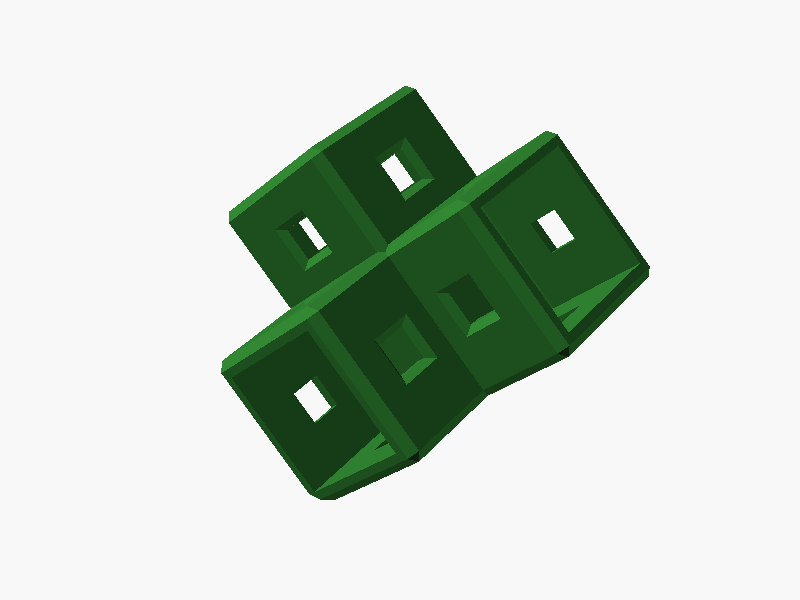
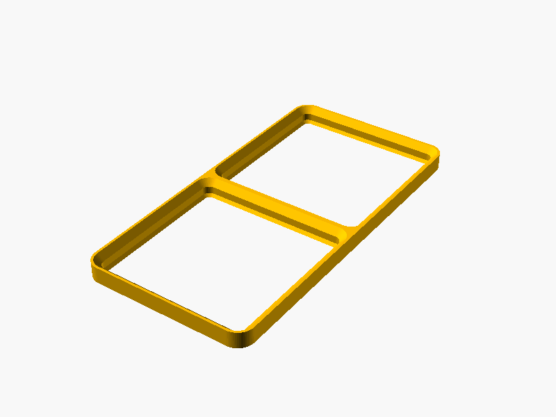
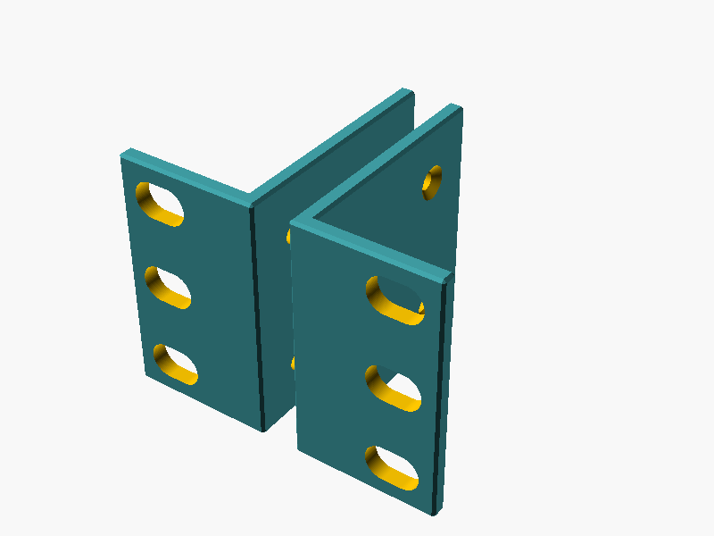
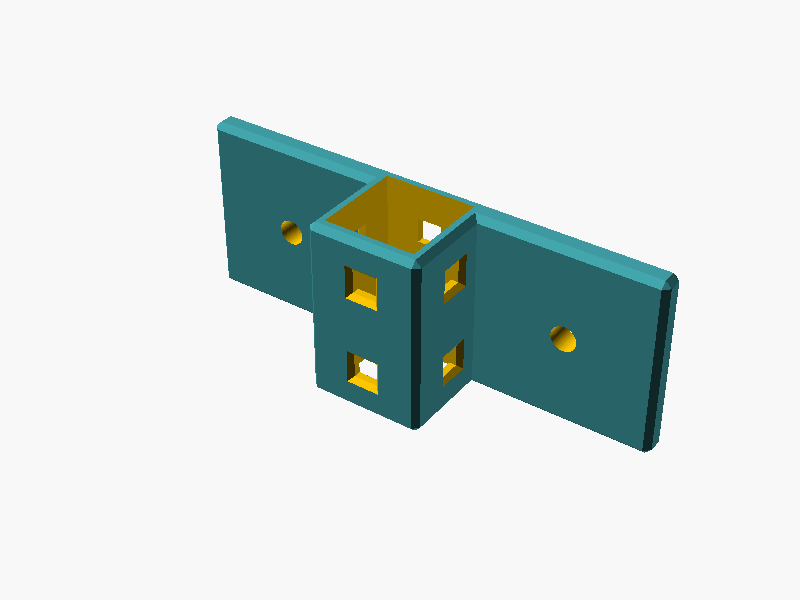

# 📦 Models

This folder contains all `scad` 3D models which come with the HomeRacker project.

## Contents

### Core

The fundamental HomeRacker building system with modular components:

- **Supports**: Vertical and horizontal structural elements
- **Connectors**: Join supports in a variety of dimensions
- **Lock Pins**: Secure connections without tools



See [core/README.md](core/README.md) for details.

### Gridfinity

Gridfinity-compatible components for modular storage integration:

- **Baseplates**: Mounting surfaces for Gridfinity bins (42mm grid)
- **Bin Bases**: Foundation for custom Gridfinity-compatible containers



See [gridfinity/README.md](gridfinity/README.md) for details.

### Rackmount Ears

Fully customizable rackmount ears for standard 10" and 19" rack mounting.



See [rackmount_ears/README.md](rackmount_ears/README.md) for details.

### Wall Mount

Wall-mountable bracket for attaching HomeRacker supports to vertical surfaces.



See [wallmount/README.md](wallmount/README.md) for details.

### Pinpusher

A utility tool for removing lock pins from connectors.


See [pinpusher/README.md](pinpusher/README.md) for details.

### Flexmount (⚠️ Deprecated)

Universal device mount — deprecated in favor of the [Customizable Rackmount](https://makerworld.com/en/models/2128492-customizable-rackmount-any-racksize#profileId-2304669) on MakerWorld.

See [flexmount/README.md](flexmount/README.md) for details.

## 📁 Standard Model Structure

Each model folder follows this convention:

```
models/<name>/
├── lib/           # Module/function definitions (no top-level geometry)
├── parts/         # Renderable instances for Customizer, testing, and PNG previews
├── presets/       # (optional) Batch export variant collections
├── makerworld/    # Self-contained exports for MakerWorld (auto-generated)
├── test/          # (optional) Test files for the model
└── README.md
```

- **`lib/`** — Reusable modules and constants. These files define geometry but don't render anything at the top level.
- **`parts/`** — Single-instance customizable files. Open in OpenSCAD Customizer to tweak parameters. Preview PNGs are stored here too.
- **`makerworld/`** — Generated by `cmd/export/export_makerworld.py` — inlines all local includes into one file for MakerWorld's parametric feature.
- Simple models may skip `lib/` if the module definition and instantiation live in a single file under `parts/`.

---

**MakerWorld exports**: Files in `<model_type>/parts/` are automatically exported on commit. See [cmd/export/README.md](../cmd/export/README.md) for details.
