# 🗜️ Bracket

## 📌 What

A clamp that wraps a device from above or below and hangs it in a HomeRacker frame. A shell grips the device, mount wings on both flanks cap the vertical supports and take a lock pin each.

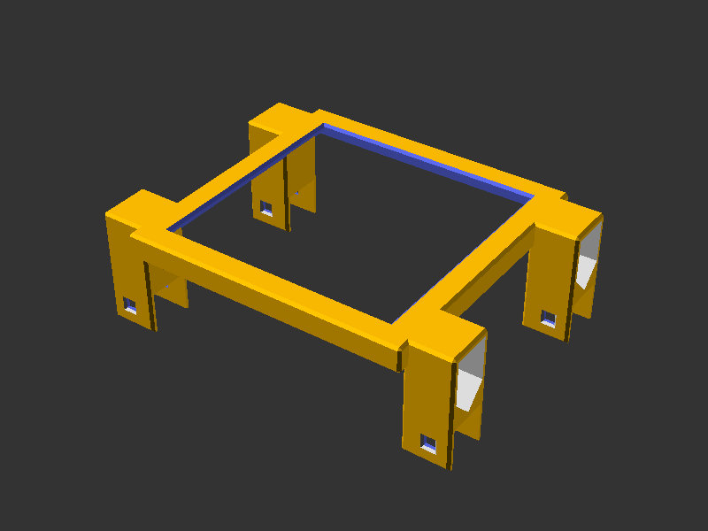

## 🤔 Why

Devices come in arbitrary sizes, HomeRacker supports sit on a 15mm grid. The wings absorb the difference: each one widens by half of what the device width misses on the grid, so the lock pin holes land on a support whatever the device measures. Nothing below/above the device, so airflow and cabling stay clear.

## 🔧 How

Open `parts/bracket.scad` in OpenSCAD and use the **Customizer** panel.

| Parameter | Default | Range | Description |
|-----------|---------|-------|-------------|
| `device_width` | 100 | 15-390 | Device width in mm |
| `device_depth` | 99 | 15-400 | Device depth in mm |
| `device_height` | 25.5 | 9.4-250 | Device height in mm |
| `strength_top` | 7.5 | 2-50 | How far the top plate reaches inward over the device |
| `strength_sides` | 7.5 | 2-50 | How far the side walls reach down the device |
| `mount_axis` | x | x, y | Which frame supports the wings hook over |
| `mount_gap_units` | 0 | 0-20 | Whole units added to the span between the wings |
| `mount_columns` | 0 | 0-2 | Wing columns, 0 picks 1 or 2 automatically |
| `mount_offset_y` | 0 | 0 to `device_depth - 15` | Pushes the wings back from the front edge |
| `debug_colors` | false | bool | Color-code geometry for debugging |
| `disable_chamfer` | false | bool | Remove chamfers (useful for debugging fit) |

Measure the device itself, not a gap. The standard 0.2mm `TOLERANCE` is added internally.

The 50mm ceiling on both strengths is a Customizer slider bound, not a limit of the model. Through the library or a `-D` override they take any value from 2mm up and clamp as described under ⚠️ Limits, which is what the `strength_sides=200` render command below does.

**Library usage**, include in your own model:

```scad
include <../bracket/lib/bracket.scad>

bracket(device_width=100, device_depth=99, device_height=25.5);
```

Implemented as a [BOSL2 attachable](https://github.com/BelfrySCAD/BOSL2/wiki/Tutorial-Attachments). `bracket_shell()`, `bracket_mount()` and `bracket_mount_pair()` are exposed for composing the halves separately. An optional `color` parameter overrides the default yellow.

## 🧭 Mount axis and gap units

A HomeRacker frame has supports running both ways. By default the wings hook the ones running along the device face (`mount_axis="x"`), which is what most devices want. Set `mount_axis="y"` and the caps turn a quarter turn to hook the supports running front to back along the sides of the frame instead.

That matters when a device is wide enough that the wings plus the connector arms eat the rack's usable width. A device wider than 164,8mm in a 10" rack is the usual case: on the X axis it does not fit, which forces a 19" rack, a tray or going off-standard (full HomeRacker). Hooking the frame sides instead moves the pins out of the contested span.

`mount_gap_units` widens the span between the wings by whole units, and it does two jobs:

- **Reach.** Extra units push the wings out to supports further away, which is how a `mount_axis="y"` bracket reaches the sides of the frame.
- **Centring.** An odd count lands on the left first (1 goes left, 2 one per side, 3 puts two left and one right), so the device sits off-centre between the supports. That is how you centre a device in a frame whose unit count does not divide evenly.

Both work on either axis.

Two things behave differently on the Y axis:

- **Column spacing steps two units at a time** and `mount_offset_y` rounds to a whole unit, because the pins go through the frame's own hole grid. Where rounding up would push the outer cap past the back of the shell, the offset steps down to the last unit that fits. Spacing comes out slightly narrower than the same device gets on X.
- **The span clears the device edge by 2.1mm**, the amount a sideways cap reaches back. A width in the last 2.1mm before a grid line costs a whole unit: 100.6mm still fits a 105mm span, 100.7mm steps out to 120mm.

## ⚠️ Limits

Seven inputs are refused outright, with an assertion naming the value that would work.

| Limit | Value | Why |
|-------|-------|-----|
| `device_height` | at least 9.4mm | The bridge skeleton cutout is rounded by half a unit, and the rounding has to fit between the bridge floor and its chamfered top |
| `device_depth` | at least 15mm | Shallower leaves no room for even one column of wings |
| `mount_offset_y` | at most `device_depth - 15` | Beyond that the wings hang off the back of the shell instead of gripping the supports |
| `mount_columns = 2` | needs `device_depth >= 45 + mount_offset_y` | Two columns any closer would merge into one block |
| `strength_top`, `strength_sides` | at least 2mm | One wall thickness is the thinnest shell that holds a device at all |
| `mount_axis` | `x` or `y` | Anything else is a typo rather than a third axis |
| `mount_gap_units` | whole number, zero or more | A fraction of a unit would put the pins off the grid |

Three inputs are silently clamped at the top end rather than refused, because the clamped result is still the part you asked for:

- `strength_top` caps at half the smaller device dimension, where the top plate closes over entirely.
- `strength_sides` caps at `device_height - 2mm`.
- `mount_columns = 0` picks two columns from a device depth of `45 + mount_offset_y`, one below that.

One thing to know before composing with the module: **the attachable bounding box covers the shell only**. The wings reach past it on all three axes, outward in X by a wing width each side, down in Z by roughly the device height plus a support unit, and in Y wherever `mount_offset_y` puts them. Anchor against the shell, then place anything near the wings by hand.

## 📸 Catalog

| Part | Preview |
|------|---------|
| Bracket |  |

### Variants

Each of these shows one behavior the module applies on its own.

| Single column (shallow device) | Forced single column | Wide wings (width near a grid line) |
|--------------------------------|----------------------|--------------------------------------|
| 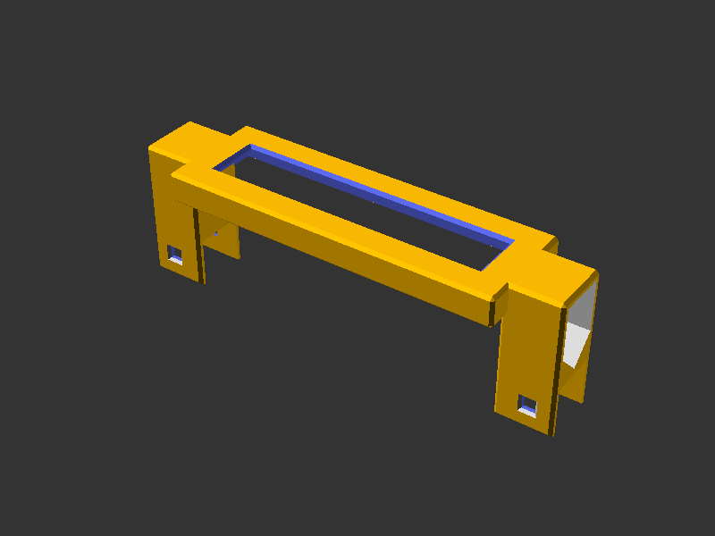 | 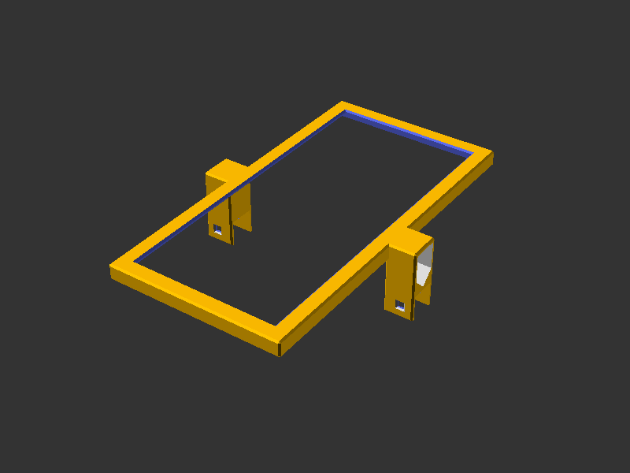 | 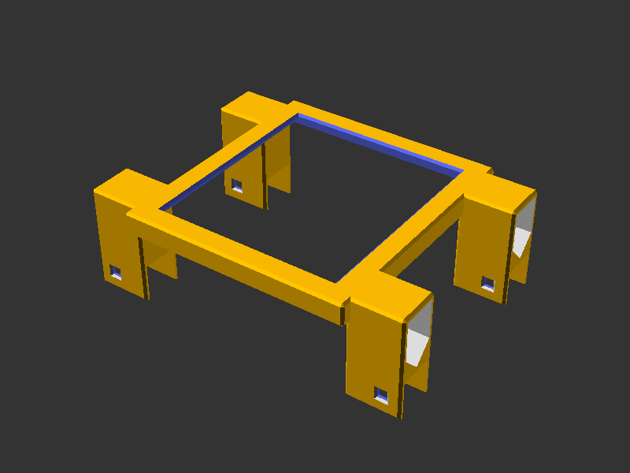 |
| `device_depth` of 30 is under the two-column threshold, so one column per side | 200mm deep but pinned to one column, which saves material on a light device | A 90mm device sits just past a grid line, so each wing grows to 22.4mm to reach the support. The lock pin hole stays on the grid |

| Mount offset | Closed top plate | Deep side walls |
|--------------|------------------|-----------------|
| 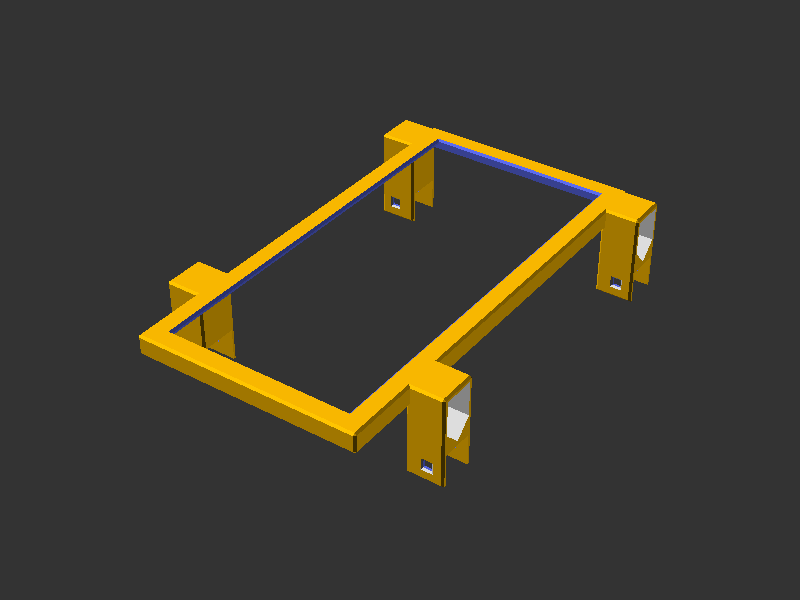 | 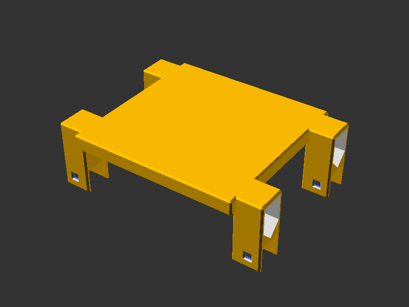 | 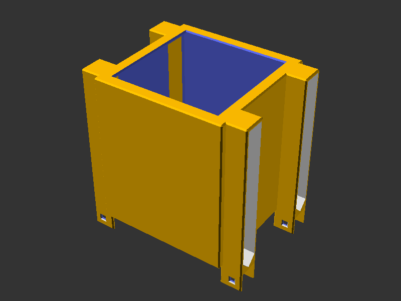 |
| `mount_offset_y` of 34 pushes both columns back, which is how a bracket clears a front panel | `strength_top` of 50 hits the cap on a 99mm device, closing the window and dropping its chamfer | `strength_sides` of 200 clamps to `device_height - 2`, wrapping a 120mm device almost to the bottom |

| Minimum strengths | Y axis | Odd gap units |
|-------------------|--------|---------------|
| 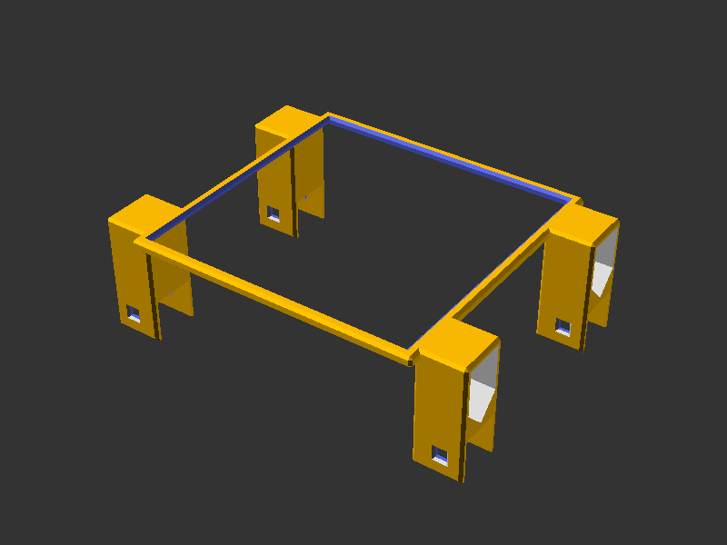 | 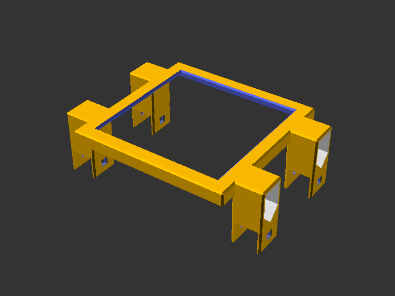 | 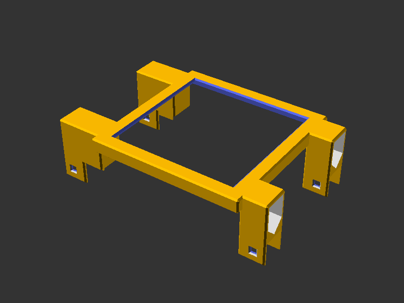 |
| Both strengths at their 2mm floor, the thinnest shell the module will build | `mount_axis="y"`, caps turned a quarter turn to hook the frame sides | `mount_gap_units=1` lands on the left, shifting the device within the frame |

| Y axis reaching out |
|---------------------|
| 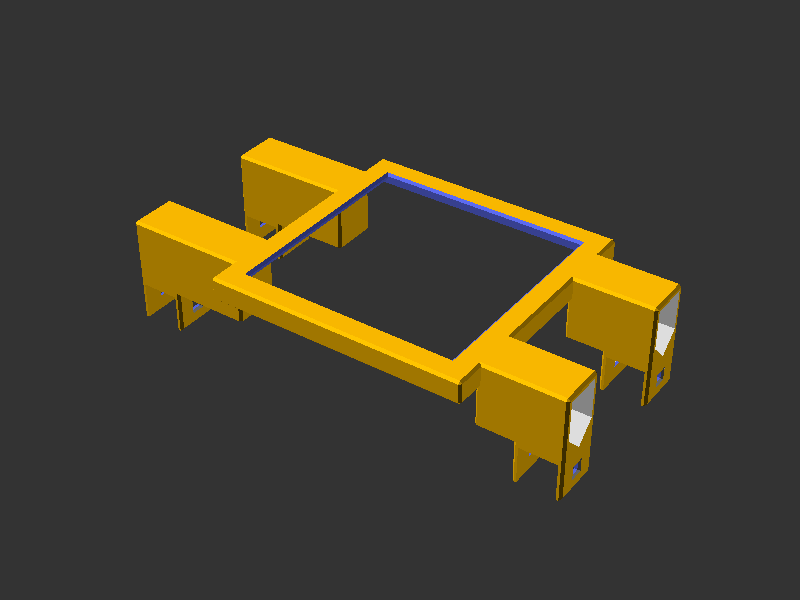 |
| `mount_axis="y"` with `mount_gap_units=3`, reaching past the near supports to the frame sides |

To generate or refresh the renders (full F6 renders via `scadm export-png`):

```sh
scadm export-png models/bracket/parts/bracket.scad
scadm export-png models/bracket/parts/bracket.scad -D device_depth=30 --output models/bracket/parts/renders/bracket_single_column.png
scadm export-png models/bracket/parts/bracket.scad -D device_depth=200 -D mount_columns=1 --output models/bracket/parts/renders/bracket_forced_single.png
scadm export-png models/bracket/parts/bracket.scad -D device_width=90 --output models/bracket/parts/renders/bracket_wide_wings.png
scadm export-png models/bracket/parts/bracket.scad -D device_depth=200 -D mount_offset_y=34 --output models/bracket/parts/renders/bracket_mount_offset.png
scadm export-png models/bracket/parts/bracket.scad -D strength_top=50 --output models/bracket/parts/renders/bracket_closed_top.png
scadm export-png models/bracket/parts/bracket.scad -D strength_top=2 -D strength_sides=2 --output models/bracket/parts/renders/bracket_min_strength.png
scadm export-png models/bracket/parts/bracket.scad -D device_height=120 -D strength_sides=200 --output models/bracket/parts/renders/bracket_deep_sides.png
scadm export-png models/bracket/parts/bracket.scad -D 'mount_axis="y"' --output models/bracket/parts/renders/bracket_axis_y.png
scadm export-png models/bracket/parts/bracket.scad -D mount_gap_units=1 --output models/bracket/parts/renders/bracket_gap_odd.png
scadm export-png models/bracket/parts/bracket.scad -D 'mount_axis="y"' -D mount_gap_units=3 --output models/bracket/parts/renders/bracket_axis_y_gap.png
```

## 📚 References

- [HomeRacker core](../core/README.md): base constants, lock pins and supports
- [Sleeve](../sleeve/README.md): the other reusable way to attach to a support
- [Return the bracket to the open-source catalog](../../docs/decisions/return-bracket-to-open-source-catalog.md): why the module lives here
