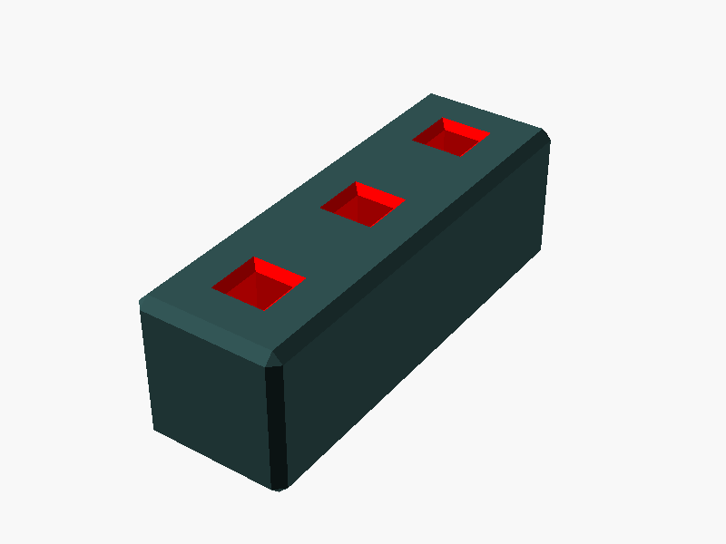
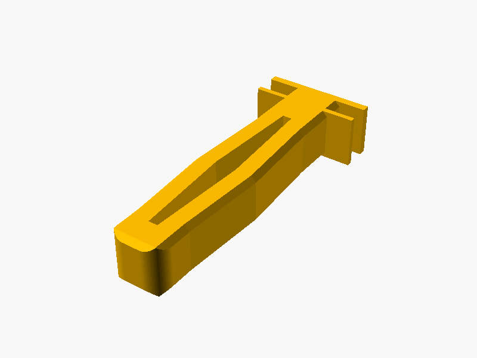

# 🧱 HomeRacker Core

## 📌 What

The core building system for HomeRacker — the fully modular 3D-printable rack-building platform.
Provides supports, connectors, and lock pins as parametric OpenSCAD modules.

## 🤔 Why

- **Modularity**: Snap-together system using standardized 15mm units — no glue, no screws
- **Parametric**: Every component is fully customizable via OpenSCAD Customizer
- **Extensible**: Library modules (`lib/`) can be included in your own projects

See the [main README's Tech Specs](../../README.md#-tech-specs) for dimensional rationale and assembly basics.

## 🔧 How

### Using the Library

Include the core library in your OpenSCAD projects:

```scad
use <core/main.scad>

// Create a 3-directional connector
connector(dimensions=3, directions=3);

// Create a support beam (3 units long)
support(units=3);

// Create a lock pin with standard grip
lockpin(grip_type="standard");
```

### Customizing Parts

Open any file in `parts/` with OpenSCAD and use the **Customizer** panel to adjust parameters:

- **`connector.scad`**: Customize dimensions, directions, pull-through axes, and orientation
- **`support.scad`**: Customize length and hole configurations
- **`lockpin.scad`**: Customize grip type (standard, extended or no-grip)

### Exporting Variants

The `presets/` folder contains modules for batch-exporting all logical variants:

- **`connectors.scad`**: Organized collections (standard, pull-through)
- **`supports.scad`**: Various support lengths with different hole configurations
- **`lockpins.scad`**: Standard grip, extended and no-grip variants

## 🧩 Core Components

### 1. **Supports** (Beams)
Structural elements with standardized connection points.
- 15mm × 15mm cross-section
- Configurable length (multiples of 15mm)
- Optional X-axis holes for cable management

### 2. **Connectors**
Junction pieces that join supports in multiple directions.
- 1D, 2D, or 3D variants (up to 6 directions)
- Optional pull-through axes for complex builds
- Lock pin holes (4mm square pins)
- Use [foot inserts](../foot/README.md) to create a stable contact interface to the ground

### 3. **Lock Pins**
4mm square pins that secure connectors to supports via tension fit.
- Standard grip: Two grip arms for easy insertion/removal
- Extended grip: Two asymmetric grip arms with a dominant outer arm.
- No-grip variant: Smooth design for minimal profile
- Bidirectional tension hole for secure fit

## 📐 Dimensional Standards

- **Base Unit**: 15mm
- **Lock Pin**: 4mm square
- **Wall Thickness**: 2mm
- **Tolerance**: 0.2mm (built into connectors)
- **Standard Chamfer**: 1mm
- **Lock Pin Chamfer**: 0.8mm

## 📸 Catalog

| Part | Preview |
|------|---------|
| Connector |  |
| Support |  |
| Lock Pin |  |

To generate or refresh previews:

```bash
./cmd/export/export-png.sh models/core/parts/<part>.scad
```

## 📝 License

- **Source Code**: MIT License
- **3D Models**: CC BY-SA 4.0

## 📚 References

- [Main Repository](https://github.com/kellerlabs/homeracker)
- [BOSL2 Library Documentation](https://github.com/BelfrySCAD/BOSL2/wiki)
