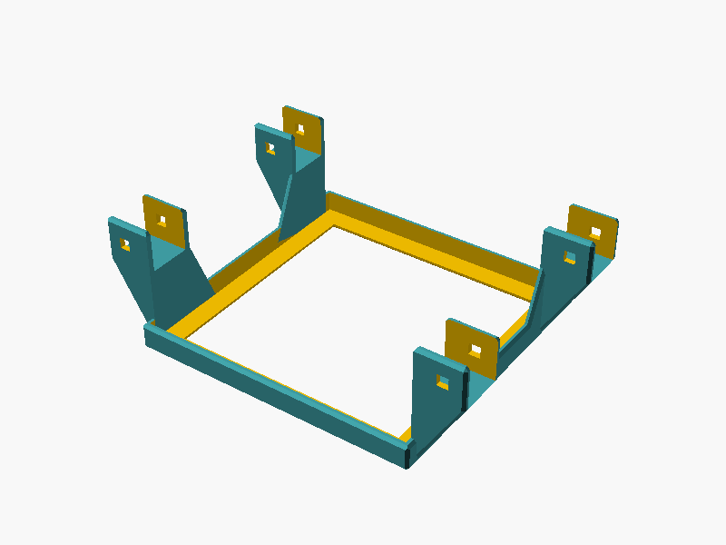

# ⚠️ Flexmount (Deprecated)

## 📌 What

A universal device mount for HomeRacker — brackets a device and attaches to the rack via connectors and lock pins.

> **Deprecated**: This model is no longer maintained. Its successor is the [Customizable Rackmount](https://makerworld.com/en/models/2128492-customizable-rackmount-any-racksize#profileId-2304669) on MakerWorld.

## 🤔 Why

Generic device mounting for arbitrary dimensions. Parametric width/depth/height with automatic modular alignment to 15mm grid.

## 🔧 How

Open `flexmount.scad` in OpenSCAD and adjust device dimensions via the Customizer:

- **Device Measurements**: `device_width`, `device_depth`, `device_height`
- **Bracket**: `bracket_strength_top`, `bracket_strength_sides`

The model auto-calculates gap fillers and offsets to snap to the HomeRacker 15mm grid.

## 📸 Catalog

| Part | Preview |
|------|---------|
| Flexmount |  |

To generate or refresh previews:

```bash
./cmd/export/export-png.sh models/flexmount/flexmount.scad
```

## 📚 References

- [HomeRacker Core](../core/README.md)
- [MakerWorld: Universal Mount for HomeRacker](https://makerworld.com) — closed-source successor
