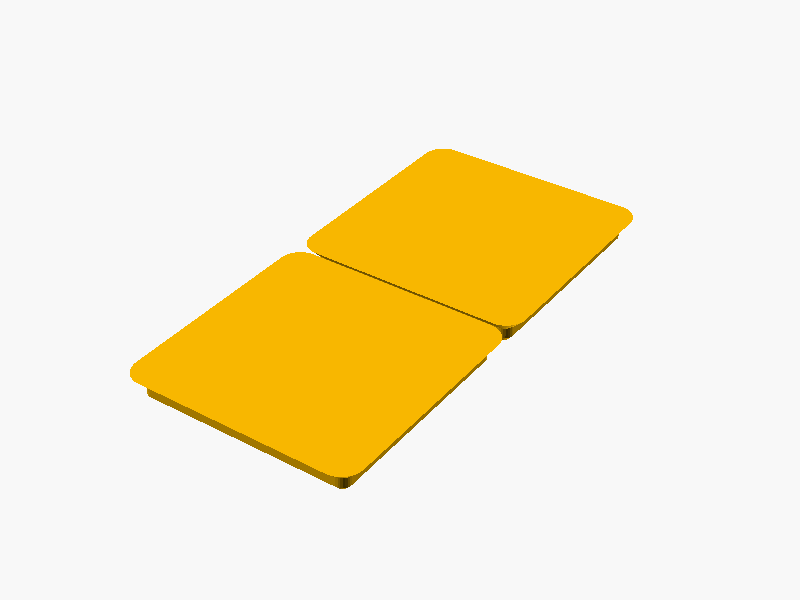

# 📦 HomeRacker Gridfinity

## 📌 What

Gridfinity-compatible baseplates and bin bases implemented as reusable OpenSCAD modules for anyone to use.
This library makes it easy to integrate Gridfinity interfaces into your models.

- **Baseplate**: Use for Gridfinity-compatible shelves or drawers
- **Bin Base**: Use as a foundation for custom Gridfinity bins

## 🤔 Why

Mainly because I can, but also other implementations I found were pretty complicated and I just wanted simple interfaces.

- Standard 42mm Gridfinity grid — compatible with the entire ecosystem
- Parametric OpenSCAD modules — include in your own projects
- Spec-compliant with [grizzie17's Gridfinity specification](https://www.printables.com/model/417152-gridfinity-specification)

## 🔧 How

### Using the Library

Include Gridfinity modules in your OpenSCAD projects:

```scad
include <gridfinity/lib/baseplate.scad>
include <gridfinity/lib/binbase.scad>

// Create a 3×2 baseplate
baseplate(units_x=3, units_y=2);

// Create a 1×2 bin base
binbase(units_x=3, units_y=2);

// This is a nice example as it places the binbase exactly onto the baseplate.
// Lets you examine tolerances :-D
```

### Customizing Parts

Open any file in `parts/` with OpenSCAD and use the **Customizer** panel to adjust parameters:

- **`baseplate.scad`**: Customize grid dimensions (x and y units)
- **`binbase.scad`**: Customize grid dimensions and preview with baseplate

### Exporting Variants

The `flattened/` folder contains pre-configured variants for export as self-contained files to MakerWorld or other platforms.

## 🧩 Core Components

### 1. **Baseplate**
Mounting surface for Gridfinity bins and organizers.
- Standard Gridfinity 42mm grid spacing
- Precise dimensional compliance with grizzie17's specification
- Optimized for 0.4mm nozzle printing
- Compatible with all standard Gridfinity bins

### 2. **Bin Base**
Bottom mounting component for custom Gridfinity-compatible containers.
- Standard Gridfinity 42mm grid spacing
- Matches baseplate cutout geometry
- Stack securely on Gridfinity baseplates
- Build custom bins on top of this foundation

## 📐 Dimensional Standards

All dimensions follow [grizzie17's Gridfinity specification](https://www.printables.com/model/417152-gridfinity-specification) for maximum compatibility.

## 📸 Catalog

| Part | Preview |
|------|---------|
| Baseplate |  |
| Bin Base |  |

To generate or refresh previews:

```bash
./cmd/export/export-png.sh models/gridfinity/parts/<part>.scad
```

## 📝 License

- **Source Code**: MIT License

## 📚 References

- [BOSL2 Library Documentation](https://github.com/BelfrySCAD/BOSL2/wiki)
- [Gridfinity Specification](https://www.printables.com/model/417152-gridfinity-specification)
