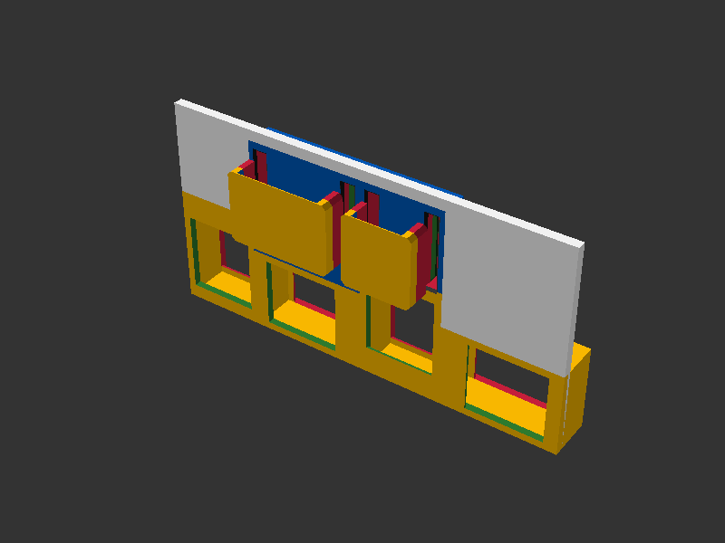
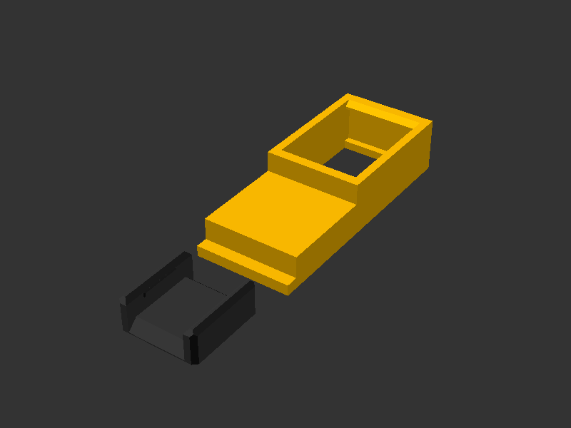

# 🔌 Keystone

## 📌 What

Parametric keystone jack socket module for integrating standard keystone connectors into HomeRacker panels. Provides the negative geometry (pocket + socket) that accepts any standard keystone module, plus optional snap-fit label plate slots for port identification.

Based on dimensions from the [Parametric Keystone Connector](https://www.printables.com/model/537480-parametric-keystone-connector) by Paul Hatcher (Public Domain / CC0).

## 🤔 Why

Keystone jacks are the universal standard for structured cabling (Ethernet, HDMI, USB, coax, fiber). By providing a reusable pocket module, any HomeRacker panel can become a patch panel without reinventing the snap-fit geometry each time.

- **Rotation support** (0°, 90°, 180°, 270°) — mount jacks vertically or horizontally to trade off panel density vs. cable bend room.
- **Snap-fit label system** — printed label plates identify ports without adhesive labels that peel off, or labels that are baked into the panel and can't be changed.
- **Label above or below** (`label_position`) — put the label slot on either side of the jack so stacked rows can tuck labels between them without covering the opening of the row above.
- **Fit-tunable** — `additional_tolerance` widens the socket cut for printers/filaments that run tighter or looser than the reference.

### Where the dimensions come from

The socket profile is **measured from** Paul Hatcher's CC0 [Parametric Keystone Connector](https://www.printables.com/model/537480-parametric-keystone-connector): that STL printed and fit a perfect range of real jacks (e.g. deleyCON CAT.7), so the distances were measured in the slicer and translated into parametric SCAD. The label dimensions instead derive from HomeRacker core constants (`KS_LABEL_HEIGHT = BASE_UNIT`, `KS_LABEL_STRENGTH = BASE_STRENGTH`, `KS_LABEL_CHAMFER = TOLERANCE * 4`) so labels stay on-system.

### Out of scope

Only *standard* keystone jacks (the universal snap profile). No angled/recessed keystones, no blank filler inserts, and no shuttered/dust-cover variants — those exist en masse online. The module is a **cutter** (negative geometry); you bring your own panel body.

## 🔧 How

### End-to-end workflow

1. **Design** a panel and cut keystone pockets into it with `keystone_full()` inside a `diff("keystone")` context (see [Library Usage](#library-usage)).
2. **Print** the panel. The socket is a tunnel through the panel; it may protrude behind a thin wall — that's expected.
3. **Snap the jack in from the *back*** of the panel. The retention hooks grab it and the front face stays clean and flush.
4. **Label (optional):** print `label_plate()` parts separately and snap them into the front recess. Labels print face-down for a clean multicolor result (see [Label system](#label-system-design)).

> 💡 **Print a single-jack sample first.** `parts/keystone_sample.scad` exists so you can print one pocket in minutes — verify your jacks seat correctly and tune `additional_tolerance` — *before* committing filament and hours to a full panel.

### Try it in the Customizer

Open `parts/keystone_sample.scad` in OpenSCAD and use the **Customizer** panel.

### Display Modes

| Mode | Description |
|------|-------------|
| `single` | One keystone at a chosen rotation angle |
| `full` | All 4 rotations side by side (90° and 180° show labels) |

### Parameters

| Parameter | Default | Description |
|-----------|---------|-------------|
| `mode` | `single` | Display mode: `single` or `full` |
| `yrotation` | `0` | Y-axis rotation in single mode (0, 90, 180, 270) |
| `additional_tolerance` | `0.0` | Extra clearance added to socket **width & height** (mm). Widens the cut → looser fit. See [Print & fit testing](#print--fit-testing). |
| `panel_depth` | `9.75` | Depth of the keystone **tunnel/cut** — *not* the panel wall thickness. Floored at the jack depth (9.75 mm); raise it only to bore a deeper tunnel through a thicker panel body. |
| `show_labels` | `true` | Show label plates on keystones |
| `label_position` | `above` | Which side of the jack the label sits on: `above` or `below` (aesthetic default; no functional difference) |
| `label_plate_mode` | `assembly` | `assembly` previews the plate in front of its slots; `plate` lays it out print-ready (used by the Parametric Model Maker for MakerWorld build plates) |
| `debug_colors` | `false` | Tints each section for debugging. **`bosl2` backend only** — native renders one fused mesh and keeps its solid identity colors. |
| `geometry` | `native` | Geometry backend: `native` (fast) or `bosl2` (per-section debug colors). See below. |

### Geometry Backend (native vs BOSL2)

The socket, panel-side label recess, and label plate each ship two interchangeable
geometry backends that produce the **identical** printable shape (verified by zero-volume
boolean parity). Pick one via the `geometry` Customizer dropdown, or globally in code with the
`$ks_native` special variable (`true` = native, `false` = BOSL2) — like `$fn` it propagates to
all children, so set it once at the top of your file.

Both backends render the model's solid identity colors (yellow socket, charcoal label plate).
The only coloring difference is `debug_colors`: native geometry is a single fused mesh, so it
cannot tint individual sections — use the `bosl2` backend when you need per-section debug colors.

> ⚠ **Disclaimer:** the `native` geometry was fully AI-transpiled from the original BOSL2 code.
> It was print-tested with no noticeable difference from the BOSL2 version, but the `bosl2`
> backend remains the authored source of truth — prefer it if in doubt.
> I personally only use the native geometry for really packed panels.

| Backend | Speed | `debug_colors` | Use when |
|---------|-------|----------------|----------|
| `native` (default) | Fast — identical jacks/plates collapse to one cached mesh, so a fully-populated panel renders many times faster | ❌ per-section coloring not available (solid identity colors still apply) | Rendering or exporting real panels, especially with many keystones |
| `bosl2` | Slow — BOSL2 re-instantiates every copy, defeating OpenSCAD's geometry cache | ✅ full per-section coloring | Editing/inspecting a single part, or when you want per-section debug colors |

Why the speed gap: native geometry definitions are cached by OpenSCAD across identical copies,
but a BOSL2 `attachable`/`diff` construction inside the geometry defeats that cache, and `diff()`
re-evaluates its subtree multiple times per copy. On a populated panel this dominated render
time, so `native` is the default.

#### Benchmark

Synthetic panel of **30 jacks (6×5) with label slots**, rendered to STL (manifold backend,
`--render`). Median of 3 runs:

| Backend | 30-jack render | Marginal cost per added jack¹ |
|---------|---------------:|------------------------------:|
| `native` | **0.17 s** | ~5.4 ms |
| `bosl2`  | 1.0 s | ~32 ms |

**≈ 6× faster** on this panel, and the gap widens as you add more jacks. ¹Marginal cost is
derived from the 1-jack vs 30-jack delta, isolating the per-copy geometry work the native cache
eliminates.

<sub>Hardware: AMD Ryzen 9 7950X (16C/32T), 64 GB RAM, Windows. OpenSCAD 2026.06.12, manifold
backend. OpenSCAD's geometry render is effectively single-threaded, so wall-clock numbers are
CPU-clock bound and reproduce closely across runs. Reproduce with `_visual_test/ks_bench.scad`
(throwaway, not tracked) — see the [decision record](../../docs/decisions/keystone-snap-fit-socket-and-labels.md) for the method.</sub>

### Label system design

The label system is an original HomeRacker design layered on top of the measured socket profile:

- **Snap-fit retention** with a minimal lip overlap — enough to hold the plate against shaking/vibration, not so much that it fights you.
- **Generous top & bottom chamfers** give you a fingernail purchase to pop a plate back out.
- **Double-slit slot** — not for style: it lets the whole part bridge cleanly so it prints **support-free**, and lets the label print **face-down** for an easy, clean multicolor result.
- **Print-ready layout** — `label_plate_mode = "plate"` lays the plate flat next to the panel so the Parametric Model Maker can drop it onto a MakerWorld build plate.



*`debug_colors = true` on the `bosl2` backend — panel body (white), socket sections (yellow), label recess (blue), label hooks (red/green).*

### Print & fit testing

`additional_tolerance` is the one knob you may need to touch. It is added **only to the socket width and height**, defaults to `0.0`, and that default fits the reference jacks perfectly on the author's printer. Because no two printers or filaments shrink alike, the single-jack sample exists to test the fit cheaply before printing a whole panel.


*Two printed single-demo panels with CAT.7 jacks snapped in from the back. Left at `additional_tolerance = 0.0` (perfect fit), right at `0.2` (a touch of wiggle).*

- `0.0` — reference fit; works as-is for the author.
- `0.2` — a hair looser; still seats and holds fine.
- `1.0` — untested; likely too loose to retain a jack. Step up in small increments.

### Library Usage

```scad
include <homeracker/models/keystone/lib/keystone.scad>

// Use in a diff("keystone") context to cut a keystone slot into a panel:
diff("keystone")
cuboid([50, 2, 50]) {
  align(FRONT, BOTTOM, inside=true)
    keystone_full(yrot=0, panel_depth=15, add_label_slots=true);
}
```

### Key Modules

| Module | Purpose |
|--------|---------|
| `keystone_full()` | Complete pocket with optional label slots — primary entry point |
| `keystone_pocket()` | Outer pocket carved into panel body (no label slots) |
| `keystone_socket()` | Inner snap-fit socket geometry matching keystone profile |
| `label_plate()` | Standalone label plate (print separately) |
| `label_recess()` | Front-face recess for label hook snap-fit |
| `keystone_demo_panel()` | Demo panel strip with one keystone mounted |

`keystone_full()` and `keystone_demo_panel()` accept `label_plate_mode` (`"assembly"` or `"plate"`) and `label_plate_gap` (mm) to control label plate placement for build-plate layouts. They also accept `label_position` (`"above"` or `"below"`) to mirror the label slot to either side of the jack.

### Key Functions

| Function | Returns |
|----------|---------|
| `get_ks_width_outer(tol)` | Outer width including walls + tolerance |
| `get_ks_height_outer(tol)` | Outer height including walls + tolerance |
| `get_ks_depth_outer()` | Total depth (front lip + body + rear hook) |
| `get_effective_keystone_width(tol, yrot)` | Width accounting for rotation |
| `get_effective_keystone_height(tol, yrot)` | Height accounting for rotation |
| `get_keystone_dimensions(yrot, tol)` | Pocket dimensions `[w, d, h]` accounting for rotation (excludes label recess) |

## 📸 Catalog

| Part | Preview |
|------|---------|
| Keystone Sample |  |
| Label Below |  |
| Plate Mode (print-ready) |  |
| Debug Colors |  |

To generate or refresh previews:

```sh
scadm export-png models/keystone/parts/keystone_sample.scad
scadm export-png models/keystone/parts/keystone_sample.scad -p models/keystone/parts/keystone_sample_below.json -P label_below --output models/keystone/parts/renders/keystone_sample_below.png
scadm export-png models/keystone/parts/keystone_sample.scad -D 'mode="single"' -D 'label_plate_mode="plate"' --output models/keystone/parts/renders/keystone_sample_plate_mode.png
scadm export-png models/keystone/parts/keystone_sample.scad -D 'mode="full"' -D 'debug_colors=true' -D '$ks_native=false' --output models/keystone/parts/renders/keystone_sample_debug.png
```

## 📚 References

- [HomeRacker core](../core/README.md) — constants, supports, connectors
- [Panel model](../panel/README.md) — plain panels that can host keystone sockets
- [Keystone socket & label design](../../docs/decisions/keystone-snap-fit-socket-and-labels.md) — decision record (provenance, label design, backend toggle)
- [Parametric Keystone Connector](https://www.printables.com/model/537480-parametric-keystone-connector) — original dimension reference (CC0)

> The HomeRacker-exclusive `keystonepanel` model is a real consumer: it lays out rows of jacks using `get_effective_keystone_width()` / `get_effective_keystone_height()` / `get_label_attachable_height()` and cuts them with `keystone_full()`.
