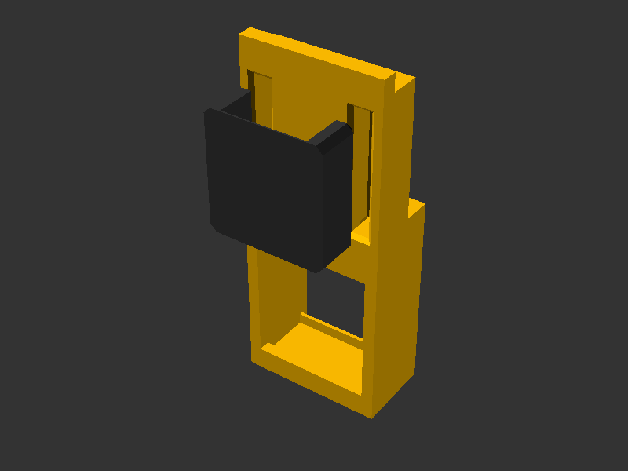
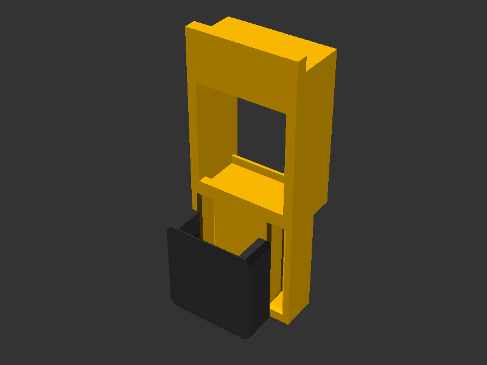

# 🔌 Keystone

## 📌 What

Parametric keystone jack socket module for integrating standard keystone connectors into HomeRacker panels. Provides the negative geometry (pocket + socket) that accepts any standard keystone module, plus optional snap-fit label plate slots for port identification.

Based on dimensions from the [Parametric Keystone Connector](https://www.printables.com/model/537480-parametric-keystone-connector) by Paul Hatcher (Public Domain / CC0).

## 🤔 Why

Keystone jacks are the universal standard for structured cabling (Ethernet, HDMI, USB, coax, fiber). By providing a reusable pocket module, any (HomeRacker) panel can become a patch panel without reinventing the snap-fit geometry each time.

- **Rotation support** (0°, 90°, 180°, 270°) — mount keystones vertically or horizontally depending on panel layout and density needs.
- **Label system** — snap-fit label plates identify ports without adhesive labels that peel off or "hard"-printed labels.
- **Label above or below** — place the label slot on either side of the jack (`label_position`), so stacked rows can carry labels between them without overlapping the jack opening above.
- **Tolerance-aware** — `additional_tolerance` parameter adjusts fit for different printers/materials. (untested. I haven't had the need to diverge yet. So use with caution)

## 🔧 How

I've created a rudimentary example on how to integrate the keystone module into a panel.

Open `parts/keystone_sample.scad` in OpenSCAD and use the **Customizer** panel.

### Display Modes

| Mode | Description |
|------|-------------|
| `single` | One keystone at a chosen rotation angle |
| `full` | All 4 rotations side by side (90° and 180° show labels) |

### Parameters

| Parameter | Default | Description |
|-----------|---------|-------------|
| `mode` | `single` | Display mode: `single` or `full` |
| `yrotation` | `0` | Y-axis rotation in single mode (0, 90, 180, 270) |
| `panel_depth` | `9.75` | Depth of the panel being cut into (mm). Increase for thicker panels. |
| `show_labels` | `true` | Show label plates on keystones |
| `label_position` | `above` | Which side of the jack the label sits on: `above` or `below` |
| `debug_colors` | `false` | Distinct colors per section for debugging |

### Library Usage

```scad
include <homeracker/models/keystone/lib/keystone.scad>

// Use in a diff("keystone") context to cut a keystone slot into a panel:
diff("keystone")
cuboid([50, 2, 50]) {
  align(FRONT, BOTTOM, inside=true)
    keystone_full(yrot=0, panel_depth=15, add_label_slots=true);
}
```

### Key Modules

| Module | Purpose |
|--------|---------|
| `keystone_full()` | Complete pocket with optional label slots — primary entry point |
| `keystone_pocket()` | Outer pocket carved into panel body (no label slots) |
| `keystone_socket()` | Inner snap-fit socket geometry matching keystone profile |
| `label_plate()` | Standalone label plate (print separately) |
| `label_recess()` | Front-face recess for label hook snap-fit |
| `keystone_demo_panel()` | Demo panel strip with one keystone mounted |

`keystone_full()` and `keystone_demo_panel()` accept `label_plate_mode` (`"assembly"` or `"plate"`) and `label_plate_gap` (mm) to control label plate placement for build-plate layouts. They also accept `label_position` (`"above"` or `"below"`) to mirror the label slot to either side of the jack.

### Key Functions

| Function | Returns |
|----------|---------|
| `get_ks_width_outer(tol)` | Outer width including walls + tolerance |
| `get_ks_height_outer(tol)` | Outer height including walls + tolerance |
| `get_ks_depth_outer()` | Total depth (front lip + body + rear hook) |
| `get_effective_keystone_width(tol, yrot)` | Width accounting for rotation |
| `get_effective_keystone_height(tol, yrot)` | Height accounting for rotation |
| `get_keystone_dimensions(yrot, tol)` | Pocket dimensions `[w, d, h]` accounting for rotation (excludes label recess) |

## 📸 Catalog

| Part | Preview |
|------|---------|
| Keystone Sample |  |
| Label Below |  |

To generate or refresh previews:

```sh
scadm export-png models/keystone/parts/keystone_sample.scad
scadm export-png models/keystone/parts/keystone_sample.scad -p models/keystone/parts/keystone_sample_below.json -P label_below --output models/keystone/parts/renders/keystone_sample_below.png
```

## 📚 References

- [HomeRacker core](../core/README.md) — constants, supports, connectors
- [Panel model](../panel/README.md) — plain panels that can host keystone sockets
- [Parametric Keystone Connector](https://www.printables.com/model/537480-parametric-keystone-connector) — original dimension reference (CC0)
