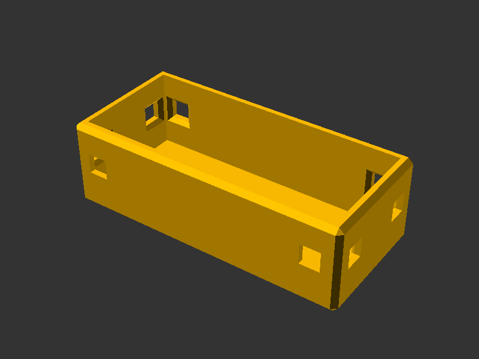

# 🖼️ Panel

## 📌 What

A plain mounting panel that fits into the HomeRacker scaffold system. Panels attach to vertical and horizontal supports via lockpin holes and can be used as-is (blank panels) or as a base for custom cutouts (keystone jacks, switches, displays, etc.).

## 🤔 Why

- **Universal base**: A generic panel module that any specialized panel (keystone, frontpanel, side panel) can build upon — no distinction between front/side at the lib level.
- **Two integration types**:
  - **Inter-Fit**: Inset panel for a flush fit between support bars. Each panel can be removed independently.
  - **Full Cover**: Overlap panel covering supports and connectors for a clean aesthetic. Must be integrated during scaffold assembly.
- **Scalable**: Supports arbitrary grid sizes (min 2×2 units). Panels larger than 2 units automatically get additional wall mounts for rigidity.

## 🔧 How

Open `parts/panel.scad` in OpenSCAD and use the **Customizer** panel.

| Parameter | Default | Range | Description |
|-----------|---------|-------|-------------|
| `panel_type` | 1 (Inter-Fit) | 1–2 | Panel integration type |
| `units_x` | 4 | 2–16 | Panel width in HR units |
| `units_y` | 2 | 2–16 | Panel height in HR units |
| `panel_clearance` | 0.0 | 0–0.4 | Full Cover only — gap between adjacent panels (mm) |
| `support_contact_x` | false | — | Add protrusions on horizontal supports (only when units_x > 2) |
| `support_contact_y` | false | — | Add protrusions on vertical supports (only when units_y > 2) |
| `debug_colors` | false | — | Show distinct colors per section for debugging |
| `chamfer_enabled` | true | — | Apply chamfers to edges |

## 📸 Catalog

| Part | Preview |
|------|---------|
| Panel |  |

To generate or refresh previews:

```sh
scadm export-png models/panel/parts/panel.scad
```

## 📚 References

- [HomeRacker core](../core/README.md)
