# 🖼️ Panel

## 📌 What

A plain mounting panel that fits into the HomeRacker scaffold system. Panels attach to vertical and horizontal supports via lockpin holes and can be used as-is (blank panels) or as a base for custom cutouts (keystone jacks, switches, displays, etc.).

## 🤔 Why

- **Universal base**: A generic panel module that any specialized panel (keystone, frontpanel, side panel) can build upon — no distinction between front/side at the lib level.
- **Two integration types**:
  - **Inter-Fit**: Inset panel for a flush fit between support bars. Each panel can be removed independently.
  - **Full Cover**: Overlap panel covering supports and connectors for a clean aesthetic. Must be integrated during scaffold assembly.
- **Scalable**: Supports arbitrary grid sizes (min 2×2 units). Panels larger than 2 units automatically get additional mount surfaces for rigidity.
- **Per-side control**: Each edge's mount surface can be enabled/disabled independently (north/south/east/west), and corner mounts can be toggled between full-height lockpin engagement and contour-only mode.

## 🔧 How

Open `parts/panel.scad` in OpenSCAD and use the **Customizer** panel.

| Parameter | Default | Range | Description |
|-----------|---------|-------|-------------|
| `panel_type` | 1 (Inter-Fit) | 1–2 | Panel integration type |
| `units_x` | 4 | 2–16 | Panel width in HR units |
| `units_y` | 3 | 2–16 | Panel height in HR units |
| `panel_clearance` | 0.0 | 0–0.4 | Full Cover only — gap between adjacent panels (mm). Default 0.0 works for most printers; increase slightly if panels are too tight |
| `corner_mounts` | true | — | Full-height corner mounts with lockpin holes (false = contour only) |
| `mount_north` | true | — | Mount plate on north (back) edge (only effective when units_x > 2) |
| `mount_south` | true | — | Mount plate on south (front) edge (only effective when units_x > 2) |
| `mount_east` | true | — | Mount plate on east (right) edge (only effective when units_y > 2) |
| `mount_west` | true | — | Mount plate on west (left) edge (only effective when units_y > 2) |
| `debug_colors` | false | — | Show distinct colors per section for debugging |
| `chamfer_enabled` | true | — | Apply chamfers to edges |

## 📸 Catalog

| Part | Preview |
|------|---------|
| Panel (Inter-Fit) | 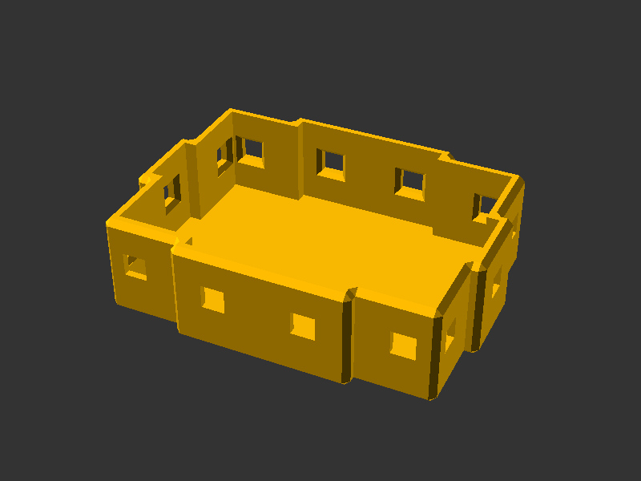 |
| Panel (Full Cover) | 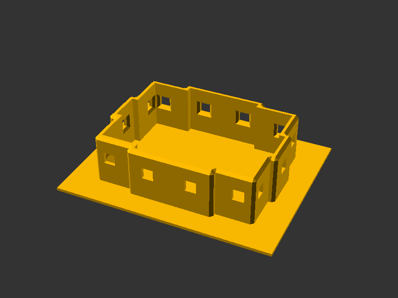 |
| Rack Panel (10") |  |
| Rack Panel (19") | 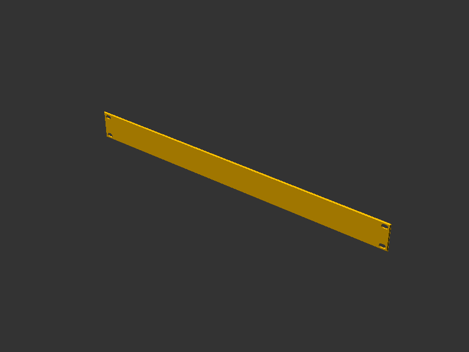 |
| Split Connector | 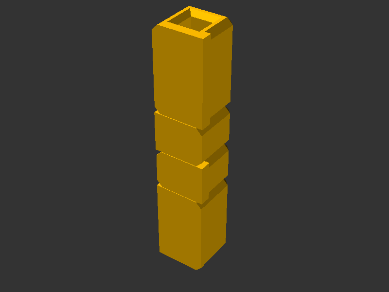 |
| Split Lock Pin | 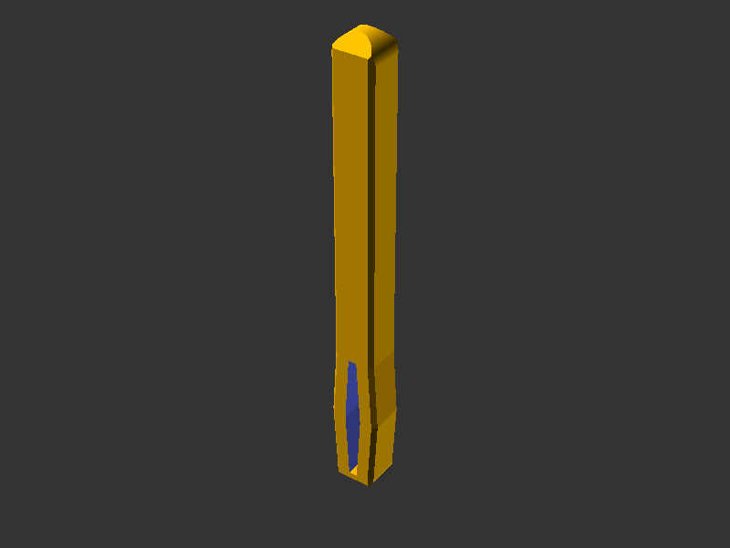 |

To generate or refresh the renders (full F6 renders via `scadm export-png`):

```sh
scadm export-png models/panel/parts/panel.scad
scadm export-png models/panel/parts/rackpanel.scad
scadm export-png models/panel/parts/split_connector.scad
scadm export-png models/panel/parts/split_lockpin.scad
```

### Panel Variants

#### Default (all mounts enabled)

| Inter-Fit | Full Cover |
|-----------|------------|
|  |  |

#### Contour Corners (corner_mounts = false)

Wherever a mount surface is disabled (corners or edges), the panel shows a contour instead — a short wall at BASE_STRENGTH height without lockpin holes. The contour provides added stability and keeps the panel opaque (no gaps), while staying short enough to not block any attachments on the HR scaffold.

**When to use corner mounts:**

Corner mounts occupy the lockpin holes normally used by supports and connectors. This matters when two panels share a 90° edge of the rack — one panel's corner mount blocks the lockpin hole needed by the other. For panels > 3×3 units, leaving corners disabled (contour only) is recommended as the mount surfaces alone provide sufficient engagement and it's easier to first build the scaffold and afterwards add panels to it.

For smaller panels (≤ 3 units on one axis), corner mounts become valuable: a 3-unit side has only 1 lockpin hole on its mount surface, and panels < 3 units have no mount surfaces at all. Corner mounts (combined with extended lockpins — neck, tail, or both variants) let these panels use connector lockpin positions that would otherwise be inaccessible.

| Inter-Fit | Full Cover |
|-----------|------------|
| 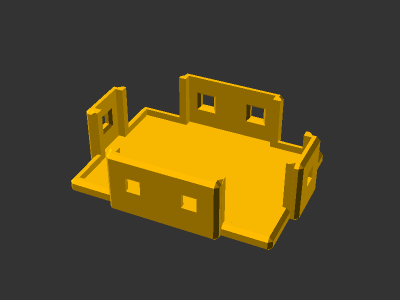 | 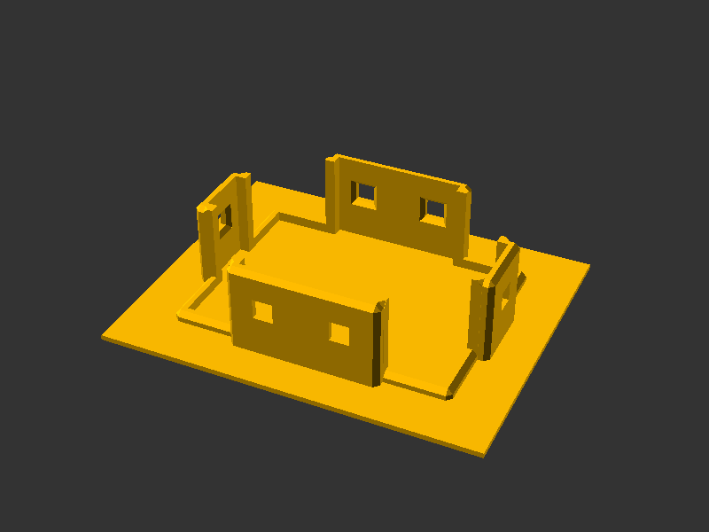 |

#### Partial Mounts (south + west disabled)

Shows the difference in wall height between panel types when mount surfaces are disabled:
- **Inter-Fit**: disabled sides get full-height walls (same as mount height) to maintain the panel contour.
- **Full Cover**: disabled sides get short 2mm walls only, keeping the area clear for attachments in the HR scaffold.

| Inter-Fit | Full Cover |
|-----------|------------|
| 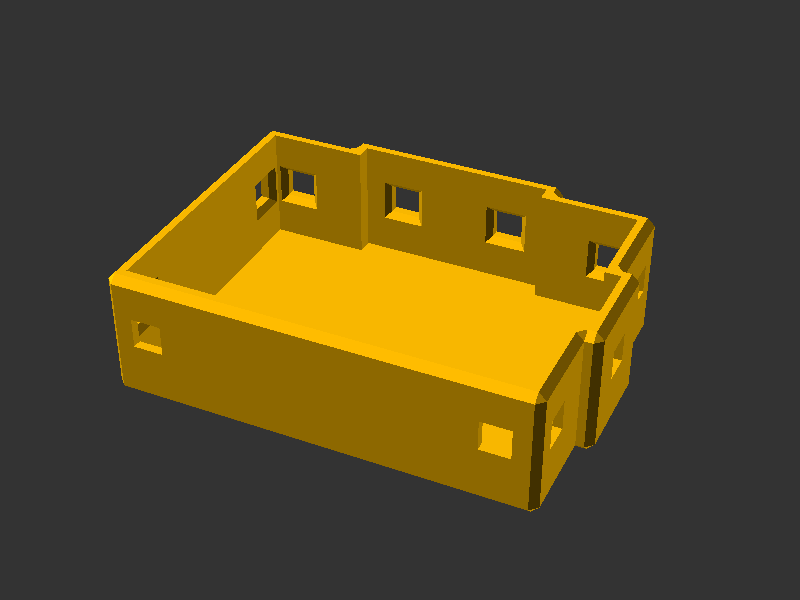 | 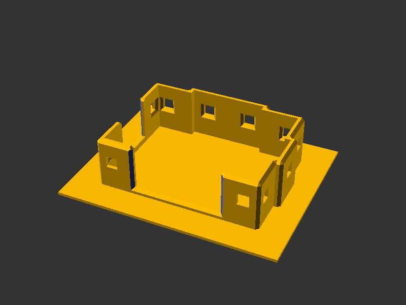 |

#### Minimal Size (2×2)

The smallest possible panel — only corner mounts, no mount surfaces (they require > 2 units). Disabling `corner_mounts` on a 2×2 panel makes the panel non-mountable.

| Inter-Fit | Full Cover |
|-----------|------------|
| 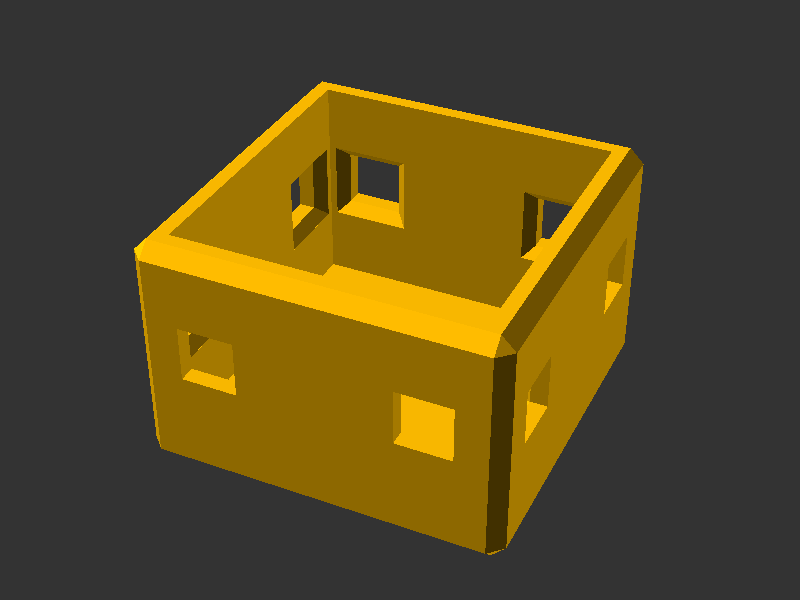 | 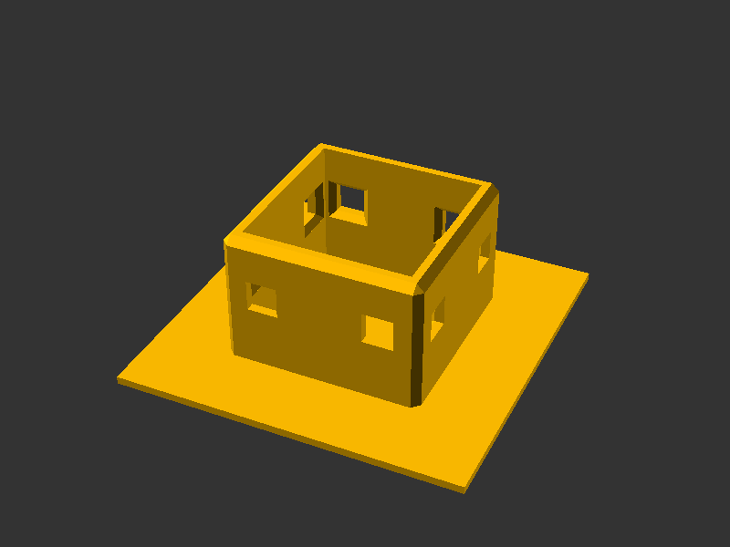 |

## 🔩 Rack Panel

A standard 10"/19" rack-compatible panel with configurable bore patterns. Open `parts/rackpanel.scad` in OpenSCAD.

### Parameters

| Parameter | Default | Range | Description |
|-----------|---------|-------|-------------|
| `panel_width_type` | 1 (10") | 1–3 | Panel width: 1 = 10", 2 = 19", 3 = Demo split (100mm, narrow demo to spare material) |
| `height_units` | 1 | 1–8 | Panel height in rack units |
| `bore_mode` | 0 (Default) | 0–2 | Bore hole pattern |
| `panel_depth_type` | 1 (Regular) | 1–2 | Panel depth (wall thickness): 1 = Regular (2mm), 2 = Strong (4mm) |
| `back_brace` | false | — | Add a triangulated truss stiffener on the panel back, flush with the split-knuckle plane — see [Stiffening](#-stiffening-depth-vs-back-brace) |
| `back_brace_density` | regular | regular, dense | Truss band density when `back_brace` is on — `regular` = 1 band per unit, `dense` = 2 bands per unit (finer triangles, but noticeably more material) |
| `split_mode` | 0 (Full) | 0–1 | Print whole (Full) or split into halves (Half) — see [Split Panels](#-split-panels) |
| `view_mode` | 0 (Assembly) | 0–2 | When split: show both halves assembled, left half only, or right half only |
| `split_connector_strength` | slim | slim, strong | Hinge connector knuckle width — `strong` uses a full base unit for extra rigidity |
| `debug_colors` | false | — | Show distinct colors per section for debugging |
| `chamfer_enabled` | true | — | Apply chamfers to edges |

### Bore Modes

| Mode | Value | 1U | 2U | 3U+ |
|------|-------|----|----|-----|
| Default | 0 | 2 bores/unit | 1 bore/unit | 1 bore/unit |
| All | 1 | 3 bores/unit | 3 bores/unit | 3 bores/unit |
| Minimal | 2 | 1 bore/unit | 1 bore top + bottom | 1 bore top + bottom, 0 inner |

### 💪 Stiffening: depth vs back brace

Two independent ways to make a panel stiffer — combine them for the most rigid result:

- **`panel_depth` (Strong, 4mm)** — thickens the whole skin. Because panels print face-down, depth is the vertical (Z) print direction, so the slicer fills the added volume with sparse gyroid infill: a deep panel becomes a cheap sandwich/I-beam that resists broad bending well. Stiffness scales with *your slicer's* infill settings, not the model.
- **`back_brace`** — a triangulated truss grown onto the **back**, protruding to the split-knuckle plane (so it stays flush with split connectors) while never touching the front face or its chamfer. Each cell carries a diagonal whose direction **alternates** in a checkerboard (a Warren/zigzag lattice), so it resists racking/torsion equally both ways instead of favouring one handedness — the kind of load gyroid infill handles poorly. On split panels each half gets its own framed sub-brace, mirrored about the centerline, with a clear gap for the connector. Bands scale with panel height so triangles stay a consistent size; columns auto-size for roughly square cells.

Rules of thumb: small panels rarely need either; wide (19") or tall multi-U panels benefit most from the brace; **`back_brace` + Minimal bore mode** is the lightest stiff combo. The brace's solid ribs are not free — `dense` density on a large panel can use more plastic than simply going to Strong `panel_depth` (which is mostly sparse infill), so prefer `regular` unless you need the extra rigidity. A panel already as deep as the knuckle plane gets no brace (it would not protrude).

> See [stiffen-rack-panels-with-truss-grid](../../docs/decisions/stiffen-rack-panels-with-truss-grid.md) for the rationale, and [lib/truss.scad](lib/truss.scad) for the generic lattice module.

### Variants

#### Default

| 1U | 2U |
|----|----|
|  |  |

#### All (Full)

| 1U | 2U |
|----|----|
| 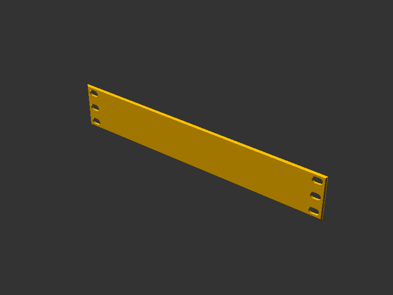 |  |

#### Minimal

| 1U | 2U | 3U |
|----|----|----|
| 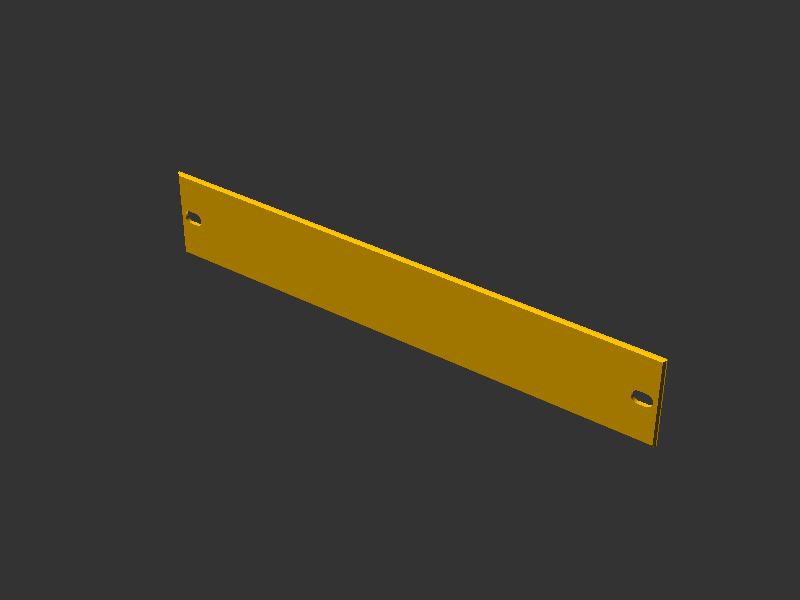 | 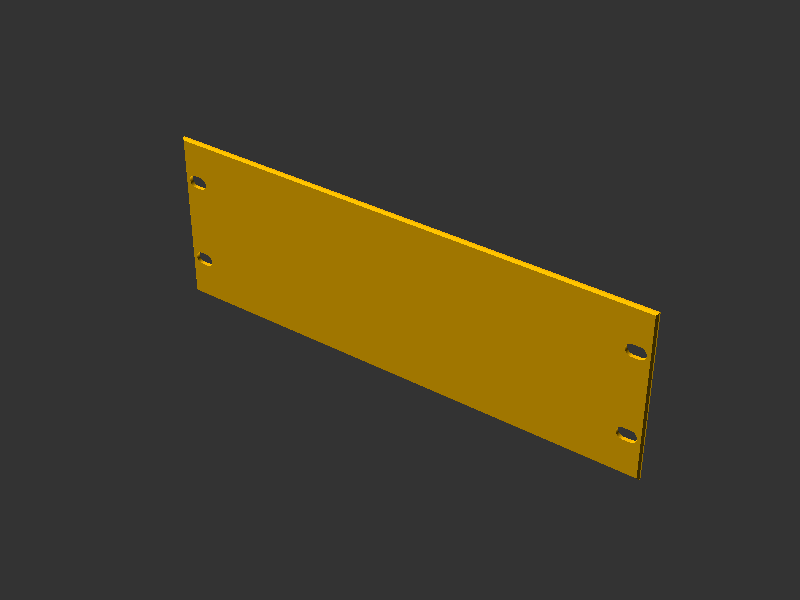 | 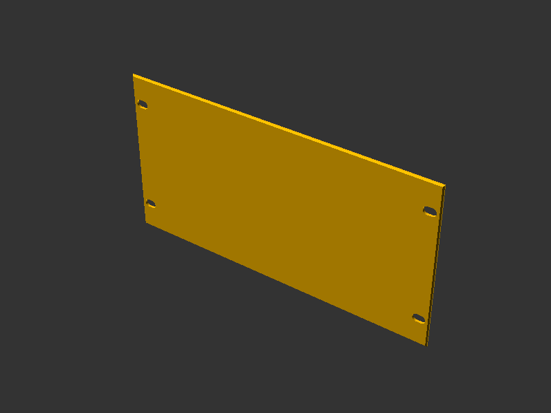 |

#### Back Brace (viewed from behind)

The triangulated stiffener grows on the panel **back**, flush with the split-knuckle plane — see [Stiffening](#-stiffening-depth-vs-back-brace). Each panel/half carries its own framed field; on a split panel the two halves mirror about the centerline with a clear gap for the connector and lock pin.

| 10" (regular) | 10" (dense) | 19" split |
|---------------|-------------|-----------|
| 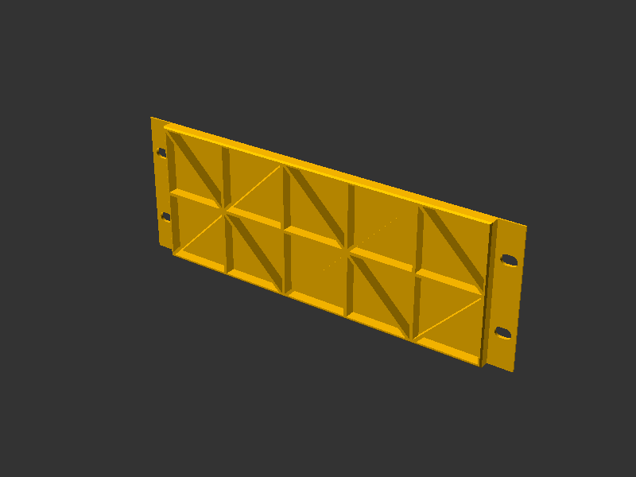 | 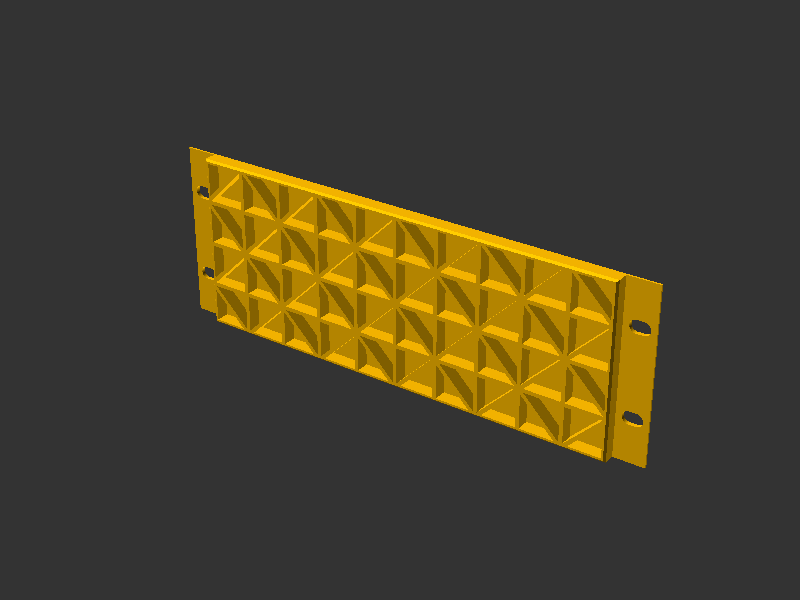 | 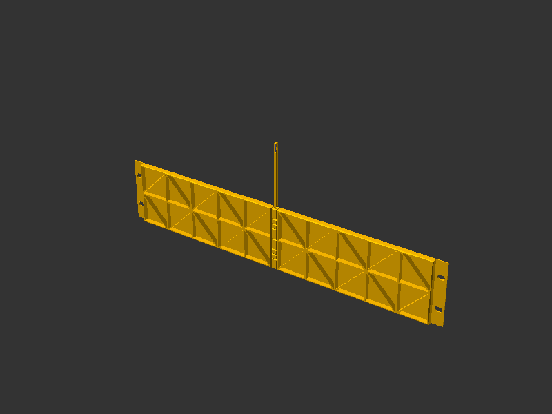 |


### Module Architecture

```text
rackpanel          → orchestrator: bore mode logic, chamfering (edge_mask)
└─ rackpanel_stack → pure stacker: one zcopies of rackpanel_1u
   └─ rackpanel_1u → single 1U body with bore subtraction (no chamfer)
      └─ bores_1u  → 1–3 evenly spaced bores per unit
└─ bores_minimal   → 1–2 bores (top + bottom unit centers) for MINIMAL mode
```

See [lib/rackpanel.scad](lib/rackpanel.scad) for implementation.

## ✂️ Split Panels

A 19" rack panel (482.6mm) is wider than most printer beds. **Split mode** divides the panel along its vertical centerline into two halves that print separately and join into a rigid panel — no glue, no fasteners beyond a single lock pin.

### How it works

- **Split connector** — a hinge-like column of interlocking knuckles is grown onto the facing edge of each half (via `split_connector`). The two halves interleave like the leaves of a door hinge. Each height unit has **four knuckles**: a **lock knuckle** (a full HomeRacker base unit with a tension lock-pin socket) at each end, and two shorter **middle knuckles** (plain 4mm square holes) sharing the space between them. The layout is point-symmetric — both halves always own exactly two knuckles and the connector is identical whichever way you rotate it, so multi-unit panels simply stack identical units straight up.
- **Split lock pin** — the `split_lockpin` part threads vertically down the aligned knuckle bores like a hinge rod and locks the joint. It reuses the standard lock pin's tension grip as its single lock element, seated in the lock knuckle at **one extreme end** of the pin; a plain shaft (with a finished chamfered end) runs from the grip up through every remaining knuckle. Multi-unit pins keep the single grip and just extend the shaft.

### Print & assembly

1. Set `split_mode = 1` (Half) and print each half — use `view_mode = 1` (Left) and `view_mode = 2` (Right), or print both at once with `view_mode = 0` (Assembly). The hinge knuckles are generated automatically as part of each half; `parts/split_connector.scad` exposes the bare connector standalone for preview and inspection.
2. Print the matching **Split Lock Pin** (`parts/split_lockpin.scad`) at the same `height_units`.
3. Interleave the two halves' hinge knuckles and slide the lock pin down through the aligned bores until it seats.

> 💡 If you print panels front-face down, use `split_connector_strength = strong` to widen each knuckle to a full base unit: the larger contact area improves layer adhesion at the split seam and reduces the risk of layer-line breakage.

> ⚠️ **Warping & thick parts**: Thicker, taller features printed on their edge (e.g. Strong `panel_depth` combined with a `strong` split connector) warp more easily — the effect is worse on textured PEI plates and toward the bed edges, where heating is less even. A warped split connector can stop the lock pin from inserting. Anecdote: on a Bambu Lab X1C (256 mm bed) with Bambu PLA Matte (Charcoal) and typical HomeRacker settings (3 walls, 15 % gyroid, Arachne wall generation), 4 mm `panel_depth` + `strong` connector knuckles warped near the bed edge and the pin would not seat. Fix: print one part at a time, laid diagonally for extra edge clearance. Larger printers are less likely to hit this.

### Parameters

**Split Connector** (`parts/split_connector.scad`)

| Parameter | Default | Range | Description |
|-----------|---------|-------|-------------|
| `height_units` | 1 | 1–8 | Connector height in rack units (match the split panel) |
| `knuckle_side` | all | all, left, right | Which knuckles to keep: both halves, or a single panel half's two knuckles |
| `connector_strength` | slim | slim, strong | Knuckle width — `strong` uses a full base unit for better layer adhesion |
| `debug_colors` | false | — | Show distinct colors per section for debugging |
| `chamfer_enabled` | true | — | Chamfer the knuckle edges |

**Split Lock Pin** (`parts/split_lockpin.scad`)

| Parameter | Default | Range | Description |
|-----------|---------|-------|-------------|
| `height_units` | 1 | 1–8 | Match the split panel this pin locks |
| `debug_colors` | false | — | Show distinct colors per section for debugging |
| `chamfer_enabled` | true | — | Chamfer the insertion ends |

### Variants

| Split Panel (2U, 19") | Split Connector (1U) | Lock Pin (1U) | Lock Pin (2U) |
|-----------------------|----------------------|---------------|---------------|
| 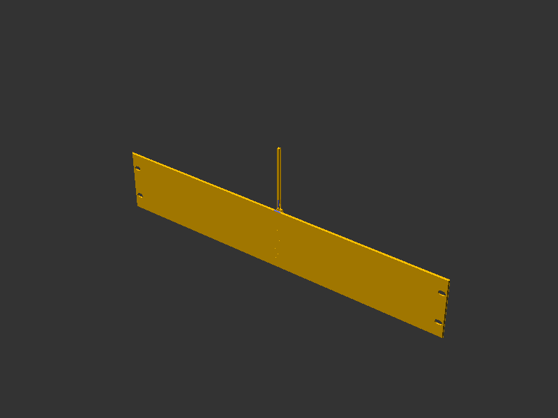 |  |  | 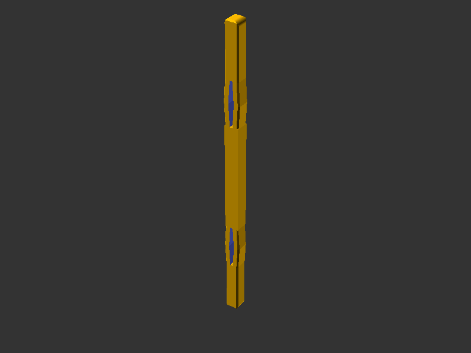 |

To generate or refresh the renders (full F6 renders via `scadm export-png`):

```sh
scadm export-png models/panel/parts/split_connector.scad
scadm export-png models/panel/parts/split_lockpin.scad
scadm export-png models/panel/parts/split_lockpin.scad -D height_units=2 --output models/panel/parts/renders/split_lockpin_2u.png
scadm export-png models/panel/parts/rackpanel.scad -D panel_width_type=2 -D height_units=2 -D split_mode=1 --output models/panel/parts/renders/rackpanel_split_2u_19inch.png
```

### Module Architecture

```text
split_connector   → 4-knuckle hinge column per unit (lock + 2 middle + lock), stacked straight up
└─ knuckle        → single knuckle: lock (tension socket) or middle (4mm square bore)
split_lockpin     → hinge-rod pin: single tension grip at one end + plain shaft through the rest
├─ split_lockpin_grip  → tension element (flex-slit grip) that seats in the bottom lock knuckle
└─ split_lockpin_shaft → plain shaft with a filleted + chamfered outer end
```

See [lib/split.scad](lib/split.scad) for implementation.

## 🧭 Anchoring Behavior

The `panel()` module is fully BOSL2-attachable. Its bounding box encompasses all mount surfaces — **not** the Full Cover base plate. This means anchors align with the functional mounting geometry, making it straightforward to position child components (e.g. keystone jacks, switches) relative to the actual panel area.

### Inter-Fit Panels

Anchors align directly with the panel's base plate + mount surfaces. The bounding box extends `BASE_STRENGTH` beyond the base plate on each side that has support mount plates (i.e. when units > 2 on that axis). The extension is always symmetric — disabling individual mount surfaces does not shrink or shift the bounding box.

### Full Cover Panels

On Full Cover panels, the overlap base plate is larger than the mount surface bounding box. **Anchors intentionally do not align with the Full Cover plate edges** — they align with the mount plate boundaries instead. This is the correct behavior because:

- Child components (cutouts, jacks) should align with the structural panel area, not the cosmetic overlap.
- Using `align(BACK+BOTTOM)` on a Full Cover panel positions the child at the mount plate's back edge — exactly where the support bar sits — maximizing usable space.

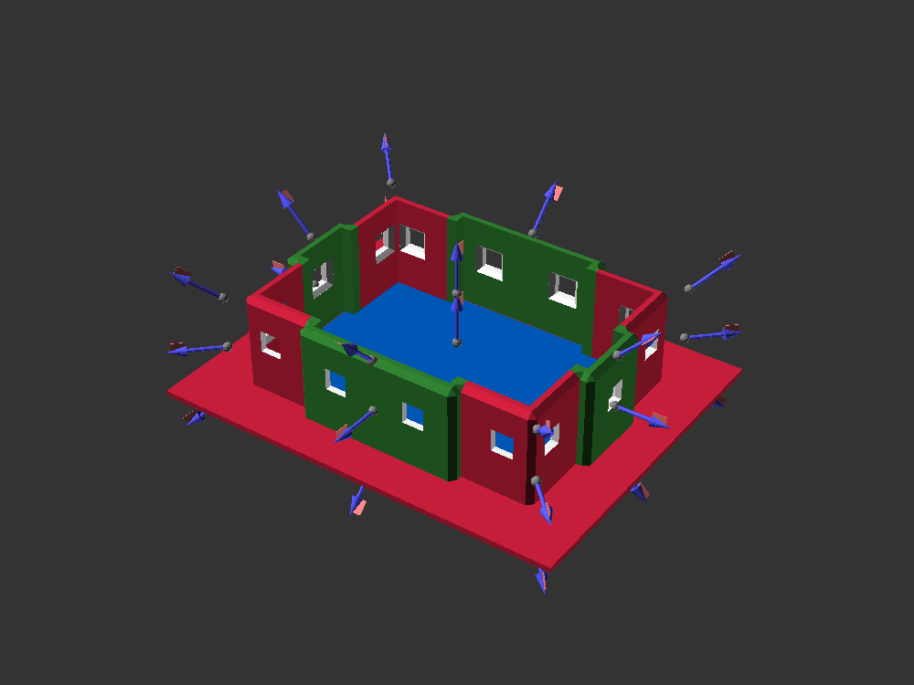

> 💡 **Example**: A keystone jack attached with `align(BACK,BOTTOM,inside=true)` perfectly aligns with the support plate edge, making optimal use of the panel's vertical space without intersecting the scaffold structure.

### Stable Anchors

Anchors remain fixed regardless of which mount surfaces are enabled or disabled. Disabling a mount plate (e.g. `mount_west=false`) removes the plate geometry but does **not** shift the bounding box or anchor positions. This ensures children attached via `align()` stay in a predictable position — aligned with the support bar boundary — even when mount plates are selectively disabled.

## 📚 References

- [HomeRacker core](../core/README.md)
