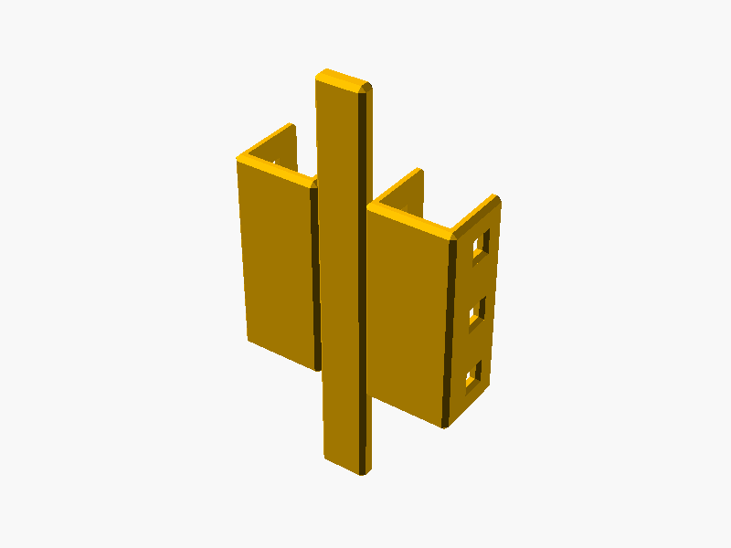

# 🔗 Racklink

## 📌 What

Connects independent HomeRacker rack columns together via double U-shaped sleeves that wrap around the vertical supports. A flat cover plate bridges the gap between columns for a clean front/back appearance.

## 🤔 Why

Building one monolithic multi-column rack requires precise planning and is error-prone. Racklink lets you build small independent columns first, then join them after the fact — add more columns later without redesigning the whole rack.

**Trade-off:** Material usage increases from `n+1` to `2n` vertical supports (where `n` = number of columns). For a 4-column rack that's 8 supports instead of 5. Worth it when flexibility matters more than material savings.

## 🔧 How

Open `parts/racklink.scad` in OpenSCAD and use the **Customizer** panel.

| Parameter | Default | Range | Description |
|-----------|---------|-------|-------------|
| `height` | 3 | 1–20 | Support height to cover (HR units) |
| `distance` | 1 | 1–5 | Horizontal gap between columns (HR units) |
| `left_start` | 0 | -10–19 | Left sleeve start offset (0 = full coverage, negative = shift down for misaligned columns) |
| `left_end` | 20 | 0–20 | Left sleeve end offset (clamped to height) |
| `right_start` | 0 | -10–19 | Right sleeve start offset (0 = full coverage, negative = shift down for misaligned columns) |
| `right_end` | 20 | 0–20 | Right sleeve end offset (clamped to height) |

**Sleeve customization:** Each U-shaped sleeve can start/end at different heights. This lets you connect columns of different heights — as long as they share at least one support unit. Negative start values shift the sleeve downward, useful when predecessor column stages have different heights and the columns don't align vertically. Invalid ranges (start ≥ end) fall back to full coverage automatically.

## 📸 Catalog

| Part | Preview |
|------|---------|
| Racklink |  |

To generate or refresh previews:

```sh
./cmd/export/export-png.sh models/racklink/parts/racklink.scad
```

## 📚 References

- [HomeRacker core](../core/README.md)
