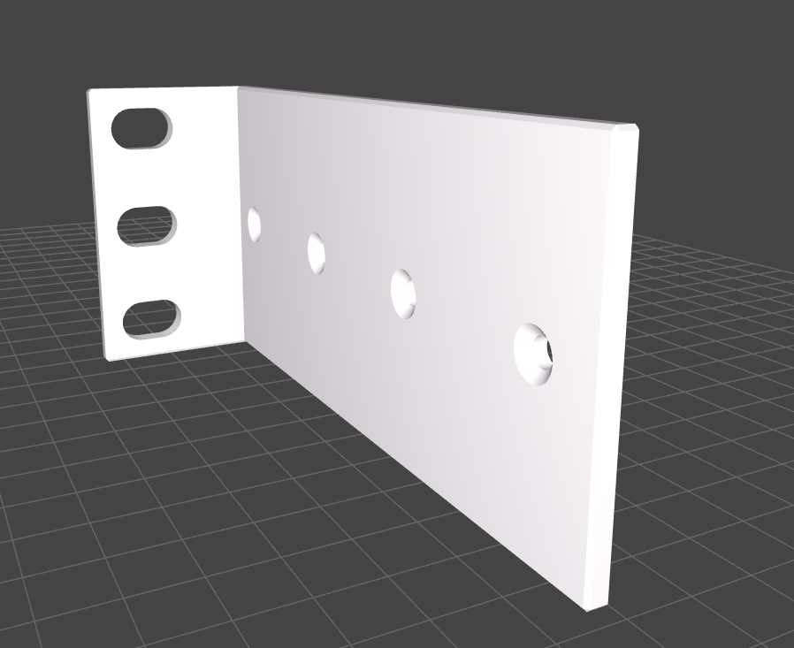
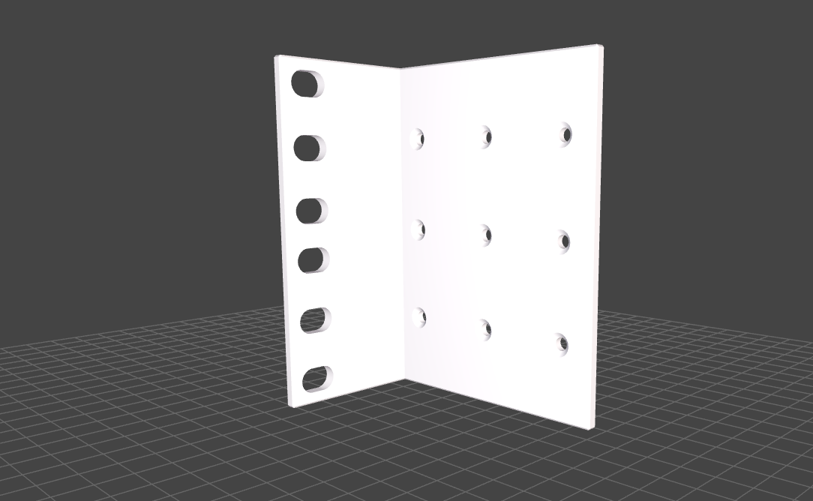

# 🔩 Rackmount Ears

## 📌 What

Fully customizable rackmount ears for standard 10" and 19" rack mounting.
Attaches devices to server racks with proper bore spacing per rack standards.

## 🤔 Why

Off-the-shelf rackmount ears rarely fit custom devices. This parametric model generates ears matched to your exact device dimensions and bore pattern.

## 🔧 How

Open `parts/rackmount_ears.scad` in OpenSCAD Customizer:

- **Base**: `device_width`, `device_height`, `strength`, `autosize` (auto-selects 10" or 19"), `asymetry`
- **Device Bores**: `device_bore_distance_front/bottom`, `device_bore_margin_horizontal/vertical`, bore diameter/countersink, `device_bore_columns/rows`

The model auto-calculates height units (1 HU = 44.5mm) and rack bore positions.

## 📸 Catalog

| Part | Preview |
|------|---------|
| Rackmount Ears |  |

Example configurations:

| Variant | Preview |
|---------|---------|
| 1 Bore Row |  |
| 2 Height Units |  |

To generate or refresh previews:

```bash
./cmd/export/export-png.sh models/rackmount_ears/parts/rackmount_ears.scad
```

## 📚 References

- [HomeRacker Core](../core/README.md)
