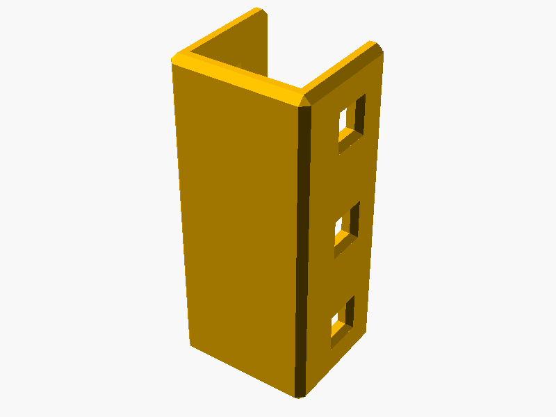

# 🧤 Sleeve

## 📌 What

A general-purpose 3-sided U-shaped sleeve that slides onto a HomeRacker support. Lock pin holes on both sides secure it in place.

## 🤔 Why

A reusable attachment primitive for anything that needs to sit on a HomeRacker support — connecting rack columns (Racklink), labeling rack sections, or mounting custom accessories.

## 🔧 How

Open `parts/sleeve.scad` in OpenSCAD and use the **Customizer** panel.

| Parameter | Default | Range | Description |
|-----------|---------|-------|-------------|
| `length` | 3 | 1–20 | Sleeve height in HomeRacker units |
| `debug_colors` | false | bool | Color-code geometry for debugging |
| `disable_chamfer` | false | bool | Remove chamfers (useful for debugging fit) |

**Library usage** — include in your own model:

```scad
include <homeracker/sleeve/lib/sleeve.scad>

sleeve(length=3);
```

Implemented as a [BOSL2 attachable](https://github.com/BelfrySCAD/BOSL2/wiki/Tutorial-Attachments). An optional `color` parameter overrides the default yellow.

## 📸 Catalog

| Part | Preview |
|------|---------|
| Sleeve |  |

To generate or refresh previews:

```sh
./cmd/export/export-png.sh models/sleeve/parts/sleeve.scad
```

## 📚 References

- [HomeRacker core](../core/README.md) — base constants and measurements
- [Racklink](../racklink/README.md) — uses sleeve as a sub-component
