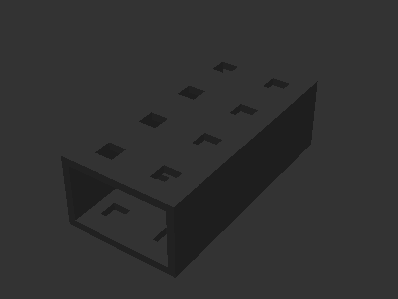

# 🔩 Truss

## 📌 What

A reinforced support system that combines two narrow (13mm) supports into a single structural unit using collars. The collar is an open rectangular tube that slides over the supports and is secured with lock pins.

## 🤔 Why

- **Strength**: Doubled cross-section for higher load capacity
- **Grid alignment**: Outer dimensions match 2× base units (30mm), lockpin holes maintain 15mm grid spacing
- **Modularity**: Brick-bond collar placement allows extending trusses to any length

## 🔧 How

Open `parts/truss_collar.scad` in OpenSCAD and use the **Customizer** panel.

| Parameter | Default | Description |
|-----------|---------|-------------|
| `units` | `4` | Collar length in base units (min 4 for brick bond) |
| `debug_colors` | `false` | Show distinct colors per feature |

### Geometry

- **Outer**: 30mm (X) × 19mm (Z) × units×15mm (Y)
- **Inner cavity**: 26.1mm × 15.1mm (fits 2× 13mm supports with tight clearance)
- **Wall thickness**: 1.95mm
- **Lockpin holes**: 2 columns through Z at every unit interval

### Assembly

1. Print two supports with `width=HR_SUPPORT_WIDTH_TRUSS` (13mm)
2. Place supports side by side (touching)
3. Slide collar(s) over supports from either end
4. Secure with lock pins through the collar holes

Use brick-bond pattern: offset collars by half their length at joints for continuous reinforcement.

### Usage

```scad
include <truss/lib/truss_collar.scad>

// Default collar (4 units)
truss_collar(units=4);

// Longer collar
truss_collar(units=6);
```

## 📸 Catalog

| Part | Preview |
|------|---------|
| Truss Collar |  |

To generate or refresh previews:

```sh
scadm export-png models/truss/parts/truss_collar.scad
```

## 📚 References

- [Core supports](../core/README.md) — the 13mm truss-width support option
- [Models index](../README.md) — all HomeRacker models
